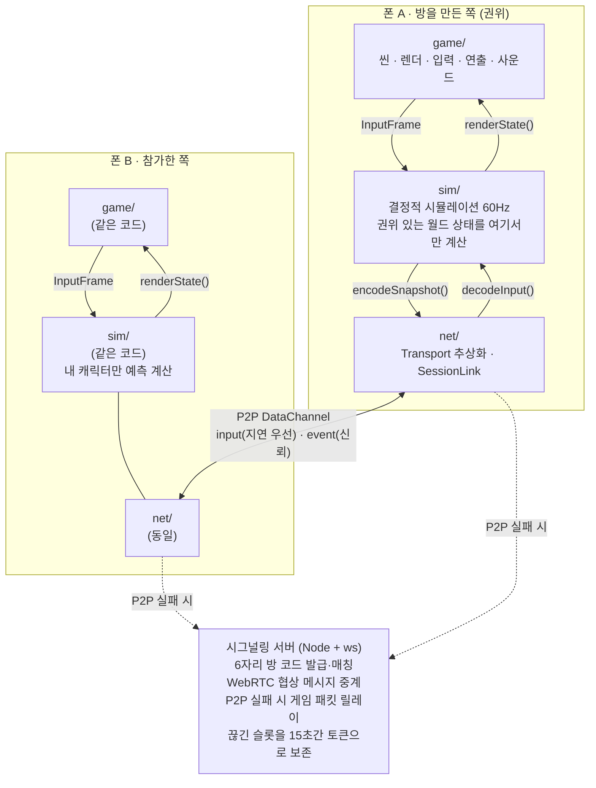
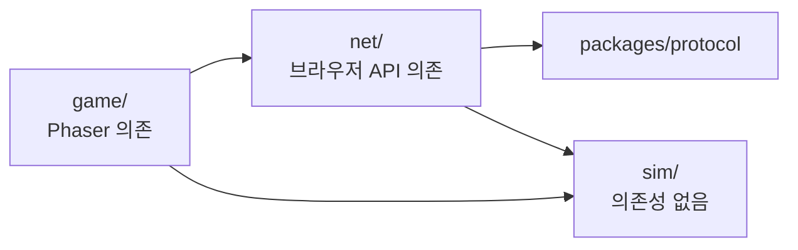
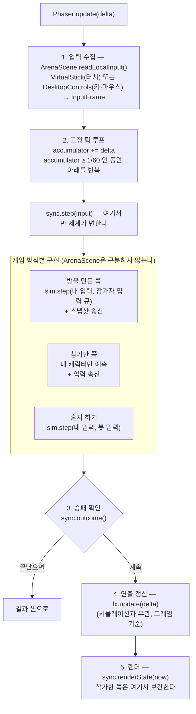
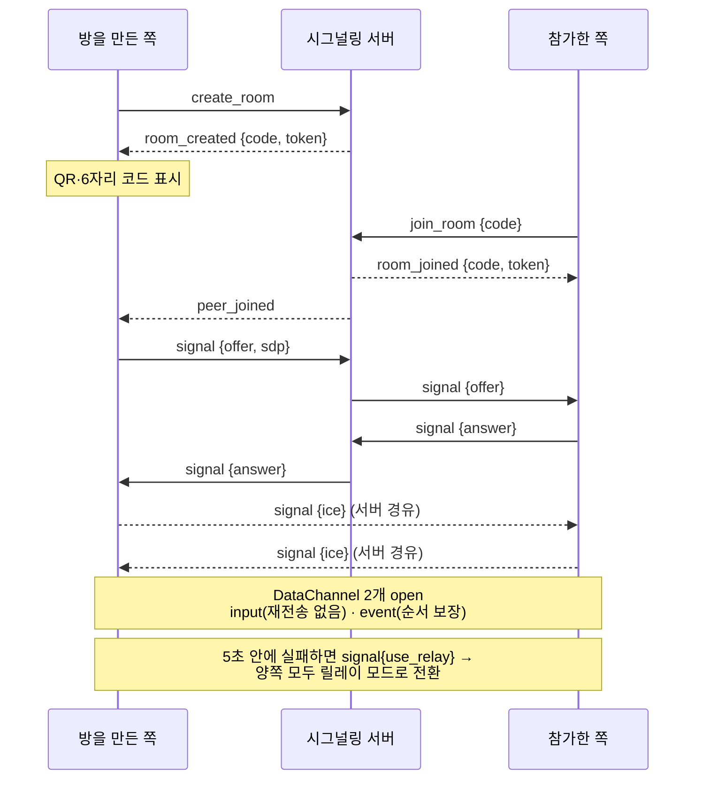
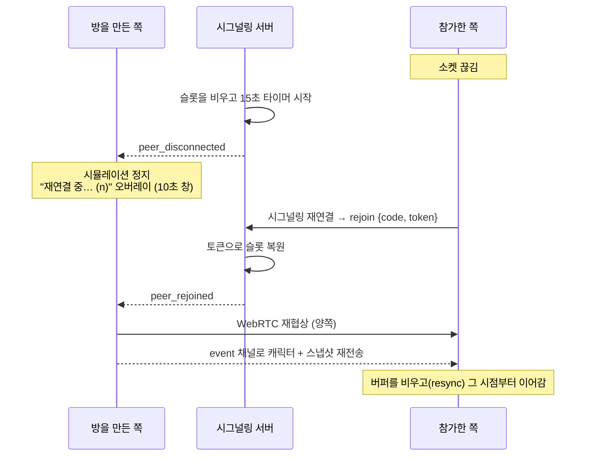
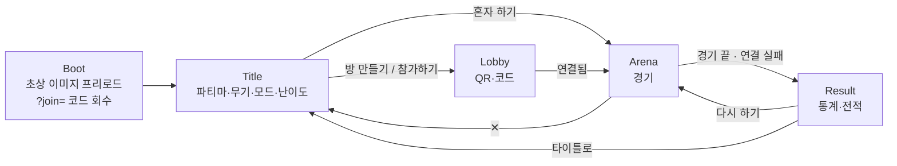
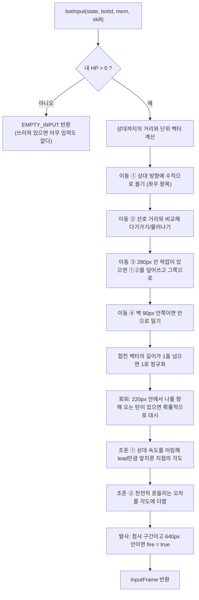

# ARENA SHOOTER 개발자 매뉴얼

모바일 웹에서 돌아가는 2인 실시간 슈팅 게임을 처음부터 만드는 방법, 그리고 이 저장소가 실제로 그렇게 만들어진 과정.

- **작성일**: 2026-09-19 (최종 갱신 2026-09-20)
- **대상**: 이런 게임을 직접 만들어 보려는 개발자, 그리고 "실시간 멀티플레이는 왜 어려운가"를 이해하려는 사람
- **분량**: 소스 56개 파일 8,556줄 (TypeScript 중심). 아래 줄 수는 모두 `wc -l` 기준이며, `find apps packages scripts -name "*.ts" -o -name "*.mts" -o -name "*.mjs"` 로 다시 셀 수 있습니다

---

## 0. 이 문서를 읽는 방법

| 목적 | 읽을 순서 |
|------|-----------|
| 전체 그림만 빠르게 | 1 → 2 → 4 |
| 코드를 고치러 왔다 | 4 → 9 → 해당 계층 장 |
| 실시간 멀티플레이를 이해하고 싶다 | 3.5 → 6 → 7 (가장 중요한 장) |
| 비슷한 걸 직접 만들겠다 | 3 → 10 → 15 (함정 모음) |
| 무슨 일이 있었는지 궁금하다 | 11 |
| 혼자 하기 상대가 어떻게 움직이는지 궁금하다 | 부록 B |

용어가 막히면 **16. 용어집**을 먼저 보세요.

---

## 1. 무엇을 만들었나

브라우저만으로 실행되는 탑다운 트윈스틱 슈터입니다. 같은 Wi‑Fi에 있는 두 사람이 QR을 찍어 1:1 대전 또는 협동 방어전을 합니다. 앱 설치가 없고, 게임 데이터는 두 기기가 **직접**(P2P) 주고받습니다.

핵심 기술 과제는 그래픽이 아니라 **네트워크 동기화**였습니다. 서로 다른 두 기기에서 60분의 1초마다 돌아가는 시뮬레이션이 "같은 세계"를 보게 만들어야 하고, 인터넷 지연(수십~수백 ms)을 감춰야 합니다.

| 지표 | 값 |
|------|-----|
| 시뮬레이션 틱 | 60Hz 고정 |
| 스냅샷 전송 | 20Hz (초당 약 9KB) |
| 입력 전송 | 60Hz (패킷 20바이트, 초당 1.2KB) |
| 목표 지연 허용치 | RTT 250ms + 패킷 손실 10%에서 플레이 가능 |
| 재접속 유예 | 클라이언트 10초 / 서버 15초 |

---

## 2. 한눈에 보는 구조



**핵심 설계 원칙 하나**: `sim/`은 Phaser·DOM·네트워크를 전혀 모릅니다. 순수 함수와 평범한 객체만 씁니다. 그래서 같은 코드가 브라우저에서도, Node에서도(테스트), 호스트에서도, 게스트 예측에서도 똑같이 돌아갑니다. 이 분리가 없으면 동기화 디버깅이 거의 불가능해집니다.

---

## 3. 기술 선택 과정

각 항목은 **후보 → 선택 → 이유 → 대가**로 정리했습니다. "무엇을 골랐나"보다 "왜 다른 걸 버렸나"가 재현에 더 중요합니다.

### 3.1 언어: TypeScript

| 후보 | 평가 |
|------|------|
| JavaScript | 빠르게 시작 가능. 그러나 패킷 바이트 레이아웃과 상태 구조가 손으로 맞춰야 하는 코드에서 오타가 런타임까지 살아남음 |
| **TypeScript** ✅ | 타입이 프로토콜 계약서 역할을 함. 클라이언트·서버가 `packages/protocol`의 같은 타입을 공유해 메시지 불일치를 컴파일 타임에 잡음 |
| Rust + WASM | 시뮬레이션 성능은 최고. 빌드 복잡도와 DOM 상호작용 비용이 이 규모에 과함 |

**대가**: 빌드 단계가 생기고, `strict` 설정에서 `noUncheckedIndexedAccess` 때문에 배열 접근마다 `!`가 붙습니다. 그래도 프로토콜 버그를 막는 값이 훨씬 큽니다.

### 3.2 렌더링: Phaser 3

| 후보 | 평가 |
|------|------|
| Canvas 2D 직접 | 의존성 0. 게임 루프·입력·씬 전환·오디오를 다 직접 만들어야 함 (며칠 추가) |
| **Phaser 3** ✅ | 씬 관리, 멀티터치 포인터, 스케일 매니저(모바일 회전/리사이즈), 오디오, 트윈이 전부 내장. 2D 슈터 레퍼런스가 많음 |
| PixiJS | 렌더러만 제공. 더 빠르고 가볍지만 씬·입력을 직접 구현해야 함 |
| Three.js | 3D용. 탑다운 2D에 불필요하고 저사양 폰에서 발열·배터리 부담 |

**대가**: JS 번들 1,743KB, gzip 434KB (프로덕션 빌드 실측). 첫 로딩이 Wi‑Fi에서 1~2초 걸립니다. 트리셰이킹이 잘 안 되는 구조라 줄이기 어렵습니다.

> **직접 만들 때 조언**: 렌더링 라이브러리 선택은 나중에 바꿀 수 있게 하세요. 이 프로젝트에서 Phaser는 `game/` 안에만 있고, `sim/`은 렌더러를 모릅니다. 그래서 PixiJS로 갈아타도 `sim/`과 `net/`은 그대로입니다.

### 3.3 빌드: Vite

- HMR이 빨라 게임 튜닝(수치 조정) 반복이 쾌적합니다
- `server.host: true` 한 줄로 LAN 노출 → 폰 실기기 테스트가 즉시 됩니다
- `define`으로 빌드 타임 상수 주입 → 개발 서버의 LAN IP를 클라이언트에 알려주는 트릭(6.6)에 사용
- 대안 Webpack/Parcel: 설정량 대비 이득 없음

### 3.4 모노레포: npm workspaces

```
apps/web         브라우저 클라이언트
apps/signaling   Node 시그널링 서버
packages/protocol  양쪽이 공유하는 메시지 타입 (42줄)
scripts/         실행·검사·아이콘 생성 유틸
```

`packages/protocol`이 핵심입니다. 서버가 보내는 메시지 타입과 클라이언트가 기대하는 타입이 **같은 파일**에서 나오므로, 한쪽만 고치면 컴파일이 깨집니다. Lerna·Nx 같은 도구는 이 규모에 불필요합니다.

### 3.5 네트워킹: 블루투스 → WebRTC (이 프로젝트에서 가장 중요한 결정)

**원래 요구사항은 "블루투스로 옆 사람과 연결"이었고, 이건 모바일 웹에서 불가능합니다.**

| 사실 | 결과 |
|------|------|
| Web Bluetooth API는 브라우저가 **Central(찾는 쪽) 역할만** 가능. Peripheral(광고하는 쪽)이 될 수 없음 | 폰 브라우저끼리는 서로를 **발견조차 못 함** |
| iOS의 모든 브라우저(Safari·Chrome·Firefox)가 WebKit 강제 → Web Bluetooth 미지원 | 아이폰 사용자 전체 제외 |
| 기기 선택은 사용자 제스처 + 브라우저 기본 팝업 필수 | 자동 매칭 UX 불가 |
| ATT 기본 MTU 23바이트(유효 20바이트), Web Bluetooth에 MTU 협상 API 없음 | 20Hz 스냅샷(400바이트) 전송 불가 |

그래서 요구사항을 **"옆 사람과 즉시, 서버 없이 붙는다"는 사용자 가치**로 재해석하고 대안을 비교했습니다.

| 대안 | iOS | 지연 | 서버 | 판정 |
|------|-----|------|------|------|
| Web Bluetooth 폰↔폰 | ✗ | — | 없음 | **기술적으로 불가능** |
| Web Bluetooth + 외부 BLE 브리지(ESP32) | ✗ | 30~80ms | 하드웨어 필요 | 오프라인 행사용 선택 트랙으로만 |
| **QR/코드 + WebRTC DataChannel** ✅ | ✓ | LAN 10~30ms | 시그널링만 | **채택** |
| WebSocket 릴레이 | ✓ | 40~150ms | 상시 필요 | P2P 실패 시 폴백으로 채택 |
| Web NFC 탭 페어링 | ✗(단계만) | — | — | Android 보조 옵션 |

**결론**: 같은 Wi‑Fi에서는 WebRTC가 mDNS/host ICE 후보로 사실상 LAN 직결이 되어 체감 지연이 블루투스와 같거나 더 낫습니다. "QR 한 번 찍고 바로 붙는다"는 경험도 그대로 유지됩니다.

> **교훈**: 요구사항이 특정 *기술*로 표현되어 있으면, 그 기술이 정말 그 *목적*을 달성할 수 있는지 먼저 검증하세요. 이 프로젝트는 그 검증을 기획 단계(M0)에서 했기 때문에 구현을 버리는 일이 없었습니다.

### 3.6 동기화 모델: 호스트 권위 스냅샷

| 후보 | 장점 | 단점 | 판정 |
|------|------|------|------|
| 결정적 락스텝 (입력만 교환, 양쪽이 똑같이 계산) | 대역폭 최소, 치팅 어려움 | 모든 입력이 도착할 때까지 **대기** → 지연이 그대로 조작감에 반영. 부동소수점 불일치 한 번이면 월드가 갈라짐 | ✗ |
| **호스트 권위 + 스냅샷** ✅ | 한쪽만 진실이라 불일치가 없음. 구현이 단순 | 호스트가 유리(지연 0). 대역폭 더 씀 | **채택** |
| 롤백 넷코드 (GGPO 방식) | 격투게임급 반응성 | 구현 난도 최상, 상태 저장/복원 비용 | 과함 |
| 권위 서버 | 공정·치팅 방지 | 상시 서버 비용, 지연 2배(왕복) | 2인 근거리 게임에 불필요 |

2인 캐주얼 게임에서 "방을 만든 쪽이 호스트"는 충분히 공정하고, 무엇보다 **디버깅이 가능한** 모델입니다.

### 3.7 직렬화: 수동 바이너리

| 후보 | 스냅샷 크기(추정) | 판정 |
|------|-------------------|------|
| JSON | ~2,000바이트 | 20Hz면 40KB/s. 모바일 셀룰러에서 부담 |
| **DataView 수동 바이너리** ✅ | ~430바이트 | 5배 작음. 바이트 레이아웃을 내가 통제 |
| Protobuf / FlatBuffers | ~500바이트 | 스키마 컴파일 단계 추가. 이 크기의 프로젝트에 과함 |

**대가**: 필드를 추가할 때 `encode`/`decode`/`*_BYTES` 상수 세 곳을 같이 고쳐야 합니다. 한 곳을 잊으면 조용히 깨집니다 → 그래서 **스냅샷 왕복 테스트**를 헤드리스 검사에 넣었습니다(12장).

### 3.8 그 밖의 선택

| 항목 | 선택 | 이유 |
|------|------|------|
| PWA | `vite-plugin-pwa` | 홈 화면 설치·오프라인 캐시를 설정 몇 줄로. 단, **iOS는 PWA로도 Web Bluetooth가 안 됩니다**(플랫폼 제약은 설치로 우회되지 않음) |
| 효과음 | Web Audio로 합성 | 에셋 파일 0개. 사격·폭발·대시를 오실레이터+노이즈로 생성 (`game/audio/Sfx.ts`) |
| 아이콘 | 의존성 없는 자체 PNG 인코더 | `scripts/make-icons.mjs`에서 zlib+CRC32로 직접 PNG를 씀. 이미지 라이브러리 설치 없이 192/512/maskable 생성 |
| QR | `qrcode`(생성) + `BarcodeDetector`/`jsqr`(인식) | 인식은 Chrome 내장 API 우선, 없으면 jsQR 폴백 |
| 캐릭터 아트 | 코드로 그린 벡터 | 스프라이트 에셋 없이 실루엣을 `Graphics` 명령으로 그림. 색·형태 튜닝이 즉시 반영 |

---

## 4. 아키텍처 상세

### 4.1 3계층과 의존 방향



**규칙: 화살표를 거스르는 import는 금지.** `sim/`이 Phaser를 import하는 순간 헤드리스 테스트가 죽고, 게스트 예측이 렌더링과 얽혀 버그를 추적할 수 없게 됩니다.

### 4.2 한 프레임에서 일어나는 일



**중요**: 시뮬레이션은 **고정 틱**(1/60초), 렌더링은 **가변 프레임**입니다. 이 둘을 섞으면 기기 성능에 따라 게임 속도가 달라집니다. `accumulator` 패턴이 이를 막습니다.

```ts
// ArenaScene.update()
this.accumulator += Math.min(deltaMs, 100) / 1000;   // 100ms 상한 = 탭 복귀 시 폭주 방지
while (this.accumulator >= SIM.dt) {
  this.accumulator -= SIM.dt;
  this.sync.step(this.readLocalInput());
}
```

### 4.3 GameSync 인터페이스 — 세 가지 모드를 하나로

```ts
interface GameSync {
  readonly kind: 'solo' | 'host' | 'guest';
  readonly localId: 0 | 1;
  step(local: InputFrame): void;              // 한 틱 진행
  handleMessage(channel, bytes): void;        // 네트워크 수신
  renderState(nowMs): RenderState;            // 그릴 상태
  outcome(): Outcome | null;                  // 승패
  summary(): MatchSummary | null;             // 통계
  resync(): void;                             // 재접속 직후 복구
  debugInfo(): string;
}
```

`ArenaScene`은 이 인터페이스만 봅니다. 그래서 씬 코드 한 벌로 솔로·호스트·게스트를 모두 처리합니다. 구현체는 `SoloSync`(65줄), `HostSync`(139줄), `GuestSync`(383줄) — 줄 수 차이가 곧 난이도 차이입니다.

---

## 5. 시뮬레이션 계층 (`apps/web/src/sim/`)

### 5.1 결정성을 지키는 규칙

같은 초기 상태 + 같은 입력 = **항상** 같은 결과. 이게 깨지면 호스트와 게스트가 다른 세계를 보게 됩니다.

| 규칙 | 구현 |
|------|------|
| `Math.random()` 금지 | 시드 기반 xorshift32를 **상태 안에** 둠 (`state.rngState`). `nextRandom(state)`가 시드를 전진시킴 |
| `Date.now()` 금지 | 시간은 틱 카운트로만 표현 |
| 부동소수점 누적 주의 | 위치는 float이지만 호스트만 권위를 가지므로 미세 차이가 누적되지 않음 |
| 순서 의존 제거 | 배열 순회 순서를 고정 (players는 항상 [0, 1]) |
| 무작위 흔들림도 결정적 | 니들 스트림 탄 흩어짐은 `spawnTick`에서 해시로 유도 → 예측과 권위가 같은 각도 |

```ts
// 탄 흔들림을 난수 대신 틱 해시로 (core.ts)
const jitter = weapon.jitterRad === 0 ? 0
  : (((spawnTick * 7919 + p.id * 104729) % 1000) / 1000 - 0.5) * weapon.jitterRad;
```

### 5.2 상태 구조 (`sim/types.ts`)

```ts
interface SimState {
  mode: 'duel' | 'coop';
  playerCount: 1 | 2;
  tick: number;        // 단조 증가 (라운드 재시작에도 되돌아가지 않음)
  elapsed: number;     // 이 라운드 진행 틱 = 경기 시간
  rngState: number;    // 결정적 난수 시드
  players: [PlayerState, PlayerState];
  stats: [PlayerStats, PlayerStats];
  bullets: BulletState[];
  nextBulletId: number;
  pickups: PickupState[];
  pickupTimer: number;
  nextPickupId: number;
  coop: CoopState | null;
}
```

`tick`이 **단조 증가**인 이유는 7.6에서 설명합니다(실제로 버그를 만든 부분입니다).

### 5.3 주요 상수 (`sim/types.ts`, `sim/weapons.ts`)

| 상수 | 값 | 의미 |
|------|-----|------|
| `SIM.tickRate` / `dt` | 60 / 1÷60 | 시뮬레이션 주기 |
| `SIM.arenaW/H` | 1280 × 720 | 월드 좌표계(화면 크기와 무관, 렌더 시 스케일) |
| `SIM.playerSpeed` | 260 px/s | 기준 이동속도 (캐릭터 배율 적용) |
| `SIM.dashSpeedMul` | 3 | 대시 중 속도 배율 |
| `SIM.bulletSpeed` | 900 px/s | 기본 탄속 |
| `SWAP_DELAY_TICKS` | 18 (0.3초) | 무기 교체 후 발사 금지 |
| `PICKUP.spawnIntervalTicks` | 900 (15초) | 픽업 스폰 주기, 최대 3개 |
| `COOP.coreMaxHp` / `waves` | 500 / 10 | 협동 모드 코어와 웨이브 수 |

### 5.4 발사를 세 조각으로 나눈 이유

```ts
applyPlayerInput(p, input)   // 이동·조준·대시·쿨다운·무기교체 — 게스트도 예측함
consumeFire(p, input)        // 발사 쿨다운 소비 여부만 판단 — 게스트도 예측함
makeBullets(p, id, tick, lag)// 실제 탄환 생성 — 게스트는 예측용 탄으로만 씀
```

이렇게 나누면 **게스트가 이동은 예측하면서 탄환 판정은 호스트에 맡기는** 구조가 자연스럽게 나옵니다. 한 함수로 뭉쳐 있으면 예측을 넣을 수 없습니다.

### 5.5 협동 모드 AI (`sim/coop.ts`)와 봇 (`sim/bot.ts`)

> 1:1 대전 봇이 어떻게 움직이고 조준하는지는 **부록 B**에 알고리즘 전체를 풀어 두었습니다. 이 절은 협동 적과 난이도 수치를 다룹니다.

적 AI는 상태 기계 없이 **매 틱 목표를 다시 계산**하는 단순 방식입니다(적 종류당 20줄 남짓). 유지보수가 쉽고 결정적입니다.

| 적 | HP | 이동 | 목표 | 행동 |
|----|----|------|------|------|
| 척후병 | 30 | 150px/s | 가장 가까운 생존 플레이어 | 직진, 접촉 피해 6 (0.75초 간격), 넉백 480px/s, 반지름 14 |
| 포수 | 50 | 120px/s | 가장 가까운 플레이어 | 거리 320 유지, 1.5초마다 사격(피해 8), 사거리 600, 접촉 피해 5, 넉백 420px/s, 반지름 16 |
| 강습병 | 200 | 70px/s | **코어** | 플레이어 무시, 접촉 피해 20, 넉백 720px/s, 반지름 26 |

**적 탄환은 코어도 때립니다.** `enemyBulletHit`이 플레이어를 먼저 검사하고, 아무도 맞지 않았으면 코어 반지름 40으로 한 번 더 판정합니다. 그래서 포수의 유탄이 코어를 8씩 깎습니다. 게임에서는 이것이 포수를 우선 처리해야 하는 이유가 되는데, 코드만 보면 눈에 띄지 않는 경로라 여기 적어 둡니다.

**접촉하면 밀려납니다.** 처음에는 접촉이 피해만 주었습니다. 그러자 척후병이 몸에 겹친 채 따라와 0.75초마다 때렸고, 실제 플레이에서 "붙잡혀서 못 움직인다"는 제보가 나왔습니다. 코드에는 붙잡는 처리가 없었지만 그렇게 느껴졌다면 그 느낌이 사실입니다. 그래서 닿으면 `knockPlayer`로 적 반대 방향 속도를 주고, `applyPlayerInput`이 이동에 더한 뒤 틱마다 0.8배로 줄입니다(`SIM.knockDecay`). 척후병 480px/s면 약 40px 미끄러집니다. 순간이동이 아니라 속도로 둔 이유는 화면에서 튀지 않게 하려는 것이고, `knockX/knockY`를 스냅샷에 싣는 이유는 참가한 쪽 예측이 넉백을 모르면 재조정 때마다 되돌아가기 때문입니다. 대시 중에는 피해가 없으므로 넉백도 없습니다.

### 웨이브 상태 기계

협동 모드 로직의 중심입니다. `stepWaves`가 세 단계를 돕니다.

| 단계 | 이름 | 하는 일 | 다음으로 넘어가는 조건 |
|------|------|---------|----------------------|
| 0 | 대기 | 타이머 감소 | 타이머가 0이면 웨이브를 올리고 편성을 만들어 1로 |
| 1 | 스폰 | 40틱마다 큐에서 한 기씩 꺼내 아레나 네 변 중 무작위 위치에 배치 | 큐가 비면 2로 |
| 2 | 소탕 대기 | 아무것도 하지 않음 | 적이 0이고 마지막 웨이브가 아니면 타이머를 180틱으로 두고 0으로 |

여기서 두 가지가 따라옵니다. 첫째, **적을 다 잡지 않으면 다음 웨이브가 시작되지 않습니다.** 구석에 한 기가 남아 있으면 단계 2에 머무릅니다. 둘째, **승리 판정이 단계 2에 걸려 있습니다.**

```ts
// core.ts — 협동 승패
if (coop.coreHp <= 0 || activePlayers(state).every((p) => p.hp <= 0)) return { won: false, ... };
if (coop.wave >= COOP.waves && coop.phase === 2 && coop.enemies.length === 0) return { won: true, ... };
```

편성은 웨이브 번호에서 바로 계산합니다. 난수가 아니므로 재현됩니다.

```ts
rushers = 2 + wave * 2
gunners = floor(wave / 2)
tanks   = wave >= 3 ? floor((wave - 1) / 2) : 0
// 큐에 담는 순서: 척후병 2 → 포수 1 → 강습병 1 반복
```

| 웨이브 | 1 | 2 | 3 | 5 | 7 | 10 | 합계 |
|--------|---|---|---|---|---|----|------|
| 2인 | 4 | 7 | 10 | 16 | 22 | 31 | **175** |
| 1인 상 | 3 | 5 | 7 | 10 | 14 | 20 | **116** |
| 1인 중 | 2 | 3 | 4 | 7 | 9 | 14 | **77** |
| 1인 하 | 1 | 2 | 2 | 6 | 7 | 10 | **53** |

**인원수로 편성을 나눈 이유**가 이 모드에서 가장 손이 많이 간 밸런스 결정입니다. 처음에는 편성이 인원수와 무관했고, 그래서 1인 방어는 두 명 몫의 물량을 혼자 상대했습니다. 자동 플레이로 재보니 클리어율이 0%였고 5~7웨이브에서 끝났습니다.

중요한 단서는 **그때 코어가 평균 300 이상 남아 있었다**는 점입니다. 코어가 뚫려서 지는 게 아니라 플레이어가 먼저 죽고 있었고, 1인에는 부활이 없으니 한 번의 죽음이 2분짜리 경기를 끝냈습니다. 그래서 물량과 지속력을 함께 손봤습니다.

| 조정 | 값 | 근거 |
|------|-----|------|
| `SOLO_ENEMY_SCALE.normal` | 0.45 | 배율을 훑어보니 0.5에서 0.45로 내릴 때 클리어율이 급격히 오르고, 0.35로 더 내려도 이득이 없었다. 즉 이 구간이 플레이어 화력과 스폰 속도가 만나는 문턱이다 |
| `PICKUP.soloIntervalTicks` | 540 (9초) | 회복 기회를 늘려 부활 없음을 부분적으로 메운다. 초기 타이머도 인원수를 따른다 |

측정 결과입니다. 시드 10개 × 캐릭터 4종 = 40판, `npm run check:balance`로 재현됩니다.

| 구성 | 조정 전 | 조정 후 |
|------|---------|---------|
| 1인 방어 클리어율 | 0% (0/40) | **45% (18/40)** |
| 1인 평균 도달 웨이브 | 5.5 ~ 7.5 | 9.4 ~ 9.7 |
| 2인 방어 클리어율 | 70% (28/40) | 70% (28/40), 손대지 않음 |

1인을 2인과 같게 만들지는 않았습니다. 부활이 없다는 차이는 그대로 두었고, 그것이 1인 방어의 성격입니다.

### 혼자 하기 난이도 (`sim/difficulty.ts`)

타이틀의 **혼자 하기** 버튼 옆 **하·중·상**으로 고릅니다. 혼자 하기는 봇과의 1:1 대전과 1인 방어 두 가지라서, 난이도 하나가 모드에 따라 다른 것을 바꿉니다. 수치는 모두 `difficulty.ts` 한 파일에 있습니다.

| 난이도 | 1인 방어 적 배율 (합계) | 대전 봇 조준 오차 | 대시 회피 확률 | 점사 / 휴식(틱) | 앞질러 쏘기 |
|--------|------------------------|-------------------|----------------|-----------------|-------------|
| 하 | 0.3 (53기) | 0.7rad | 8% | 24 / 45~85 | 없음 |
| 중 | 0.45 (77기) | 0.36rad | 35% | 30 / 30~60 | 없음 |
| 상 | 0.65 (116기) | 0.22rad | 50% | 36 / 22~46 | 비행 시간의 절반만큼 |

중은 난이도를 넣기 전의 값 그대로입니다. 그래서 난이도를 한 번도 건드리지 않은 사람에게는 아무것도 바뀌지 않았습니다.

**난이도는 `SimState.difficulty`에 실립니다.** 웨이브 편성이 시뮬레이션 안에서 결정되므로 상태에 있어야 합니다. 다만 둘이 하는 경기는 항상 `normal`이고 스냅샷에도 싣지 않습니다(디코드하면 `normal`). 봇 솜씨는 시뮬레이션 규칙이 아니라 봇 입력의 성질이므로 상태에 넣지 않고 `SoloSync`가 `botInput`에 `BotSkill`로 넘깁니다. 고른 값은 무기 선택처럼 registry와 localStorage(`arena.difficulty`)에 남습니다(`game/difficulty.ts`).

`npm run check:balance`로 잰 결과입니다. 방어는 자동 플레이 40판, 대전은 **중 봇을 기준 상대로** 40판입니다.

| 난이도 | 1인 방어 클리어율 | 중 봇 상대 승률 |
|--------|-------------------|-----------------|
| 하 | 78% (31/40) | 18% (7/40) |
| 중 | 53% (21/40) | 43% (17/40) |
| 상 | 15% (6/40) | 98% (39/40) |

대전 '상'의 98%는 과장되어 보이지만 봇끼리의 대결이라 그렇습니다. 중 봇은 좌우 왕복이 규칙적이어서 앞질러 쏘기에 특히 약합니다. 사람은 그보다 움직임을 읽기 어렵습니다. 처음 값(오차 0.14, 회피 60%, 앞지르기 0.8)은 40전 40승이어서 한 단계 낮췄습니다. 방어 수치는 접촉 넉백을 넣은 뒤 다시 잰 것입니다(넣기 전 중 45%, 상 10%). 방어 '상' 15%도 자동 플레이 기준이므로, 사람에게는 "잘하면 깰 수 있는" 정도를 노렸습니다.

**측정 도구를 두 번 버렸다가 세 번째에 남겼습니다.** 밸런스를 만질 때마다 호스트·게스트 자동 플레이 하네스를 다시 쓰고 있었습니다. 지금은 `scripts/coop-balance.ts`로 남아 있습니다. 자동 플레이어는 사람보다 약하므로 절대값이 아니라 **변경 전후의 차이**를 보는 도구입니다. 실제로 이 도구의 픽업 판단이 조잡했을 때(체력이 가득해도 회복팩을 주우러 감) 측정이 왜곡되어 잘못된 결론이 나왔습니다. 측정기를 먼저 고친 뒤에야 0.45라는 값이 보였습니다.

**초반 난이도를 가르는 것은 적의 수가 아니라 조준이었습니다.** 두 사람이 2인 1웨이브에서 두 번 연속 쓰러진 뒤, 초반 웨이브를 줄이기 전에 어디서 지는지를 쟀습니다. 자동 플레이어는 1~6웨이브에서 한 번도 쓰러지지 않았고, 가만히 서서 쏘기만 해도 마찬가지였습니다. 그런데 조준에 사람 수준의 흔들림(명중률 12%)을 넣자 1인 '하'에서도 40%, '중'에서 65%가 1웨이브에서 쓰러졌습니다. '하'는 1웨이브 적이 1기뿐이므로 적을 더 줄여서는 답이 안 나옵니다. 조준 보정 18도를 넣으면 같은 초보자의 명중률이 28%가 되고 1웨이브 다운이 하 1%, 중 12%, 2인 1%로 떨어져, 쓰러지는 지점이 4~6웨이브로 밀려났습니다. 그래서 적 편성은 그대로 두고 조준 보정을 넣었습니다. 자동 플레이 밸런스(`check:balance`)는 조준이 완벽한 봇이라 보정의 영향을 받지 않습니다.

휴식 180틱과 스폰 간격 40틱이 있으므로, 적을 즉시 처치해도 10웨이브를 끝내는 데 **최소 140초**가 걸립니다. 이것이 한 경기의 하한입니다.

### 부활

`stepRevive`는 `playerCount`가 2 미만이면 즉시 반환합니다. 그래서 **혼자 하기에는 부활이 없고 다운이 곧 패배입니다.** 위 밸런스 조정이 필요했던 근본 원인이 이것입니다.

| 상수 | 값 | 의미 |
|------|-----|------|
| `reviveRadius` | 70 | 이 안에 있어야 진행 |
| `reviveTicks` | 120 (2초) | 채우면 부활 |
| `reviveHpRatio` | 0.5 | 최대 HP의 절반으로 살아난다 |

곁을 떠나면 진행도가 **틱당 2씩** 줄어듭니다. 채울 때가 틱당 1이므로 이탈은 두 배로 손해입니다. 잠깐 빠졌다 돌아오는 플레이를 억제하려는 의도입니다.

코어는 좌표 (640, 360)에 반지름 40으로 있지만 **이동 판정은 없습니다.** 플레이어와 적이 통과합니다. 엄폐물을 넣으려면 이동 충돌을 새로 만들어야 합니다.

1인 대전의 봇(`bot.ts`)은 사람처럼 보이도록 **일부러 불완전하게** 만들었습니다. 괄호 안은 중 난이도 값이고, 하·상의 값은 위 난이도 표에 있습니다:
- 거리 280~460을 유지하며 1~2초마다 좌우 방향 전환
- 조준에 오차를 천천히 흔들며 적용 (중: ±0.18rad. 완벽 조준은 재미없음)
- 점사 (중: 0.5초 사격 / 0.5~1초 휴식)
- 자기 쪽으로 오는 탄이 220px 안에 들어오면 확률적으로 대시 회피 (중: 35%)
- 상 난이도만 상대의 직전 이동으로 속도를 어림해 앞질러 쏜다
- 280px 안의 픽업으로 이동

---

## 6. 네트워크 계층과 프로토콜 (`apps/web/src/net/`, `apps/signaling/`)

### 6.1 두 개의 프로토콜

| 용도 | 전송 | 형식 | 정의 위치 |
|------|------|------|-----------|
| 방 만들기·참가·WebRTC 협상·재접속 | WebSocket (TCP) | **JSON** | `packages/protocol/src/index.ts` |
| 게임 입력·스냅샷·이벤트 | WebRTC DataChannel (SCTP/UDP) | **바이너리** | `apps/web/src/sim/serialize.ts` |

시그널링은 초당 몇 개뿐이라 가독성이 중요 → JSON. 게임 데이터는 초당 80개라 크기가 중요 → 바이너리. **용도에 따라 다른 형식을 쓰는 것이 정답**입니다.

### 6.2 연결 수립 시퀀스



### 6.3 시그널링 프로토콜 (JSON)

```ts
// 클라이언트 → 서버
type ClientToServer =
  | { t: 'create_room' }
  | { t: 'join_room'; code: string }
  | { t: 'rejoin'; code: string; token: string }   // 끊긴 슬롯 되찾기
  | { t: 'signal'; data: SignalPayload };

// 서버 → 클라이언트
type ServerToClient =
  | { t: 'room_created'; code: string; token: string }
  | { t: 'room_joined'; code: string; token: string }
  | { t: 'rejoined'; code: string; role: 'host' | 'guest' }
  | { t: 'peer_joined' }
  | { t: 'peer_disconnected' }   // 끊겼지만 15초 유예 중
  | { t: 'peer_rejoined' }
  | { t: 'peer_left' }           // 유예 시간 초과 (최종)
  | { t: 'signal'; data: SignalPayload }
  | { t: 'error'; code: 'room_not_found' | 'room_full' | 'bad_token' | 'bad_message' };

type SignalPayload =
  | { kind: 'offer'; sdp: string }
  | { kind: 'answer'; sdp: string }
  | { kind: 'ice'; candidate: IceCandidate }
  | { kind: 'use_relay' };        // "나는 P2P 포기했다, 너도 릴레이로 와라"
```

**토큰이 왜 필요한가**: 방 코드만으로 재입장을 허용하면 아무나 남의 슬롯을 가로챌 수 있습니다. 서버가 슬롯마다 `randomUUID()` 토큰을 발급하고, 재접속은 토큰으로만 인정합니다.

### 6.4 게임 프로토콜 (바이너리)

모든 패킷의 첫 바이트가 타입입니다.

| 타입 | 값 | 크기 | 방향 | 채널 |
|------|-----|------|------|------|
| INPUT | `0x01` | 20바이트 | 게스트 → 호스트 | input (unreliable) |
| CHARACTER | `0x02` | 3바이트 | 양방향 | event (reliable) |
| SNAPSHOT | `0x03` | 가변(~430바이트) | 호스트 → 게스트 | input, 최종본만 event |
| REMATCH | `0x04` | 1바이트 | 양방향 | event (reliable) |

#### INPUT (20바이트) — 손실에 대비해 3틱을 중복 전송

```
오프셋  크기  내용
  0      1   0x01
  1      4   u32  tick (최신 틱)
  5      5   frame[0]  ← tick     의 입력
 10      5   frame[1]  ← tick - 1 의 입력
 15      5   frame[2]  ← tick - 2 의 입력

frame 5바이트:
  +0  i8  moveX  (-127..127, /127로 정규화)
  +1  i8  moveY
  +2  i8  aimX
  +3  i8  aimY
  +4  u8  bits: bit0=fire, bit1=dash, bit2=skill, bit3~4=swapTo(0~3)
```

**왜 중복인가**: input 채널은 재전송이 없는(unreliable) 채널입니다. 패킷 하나가 사라지면 그 틱의 입력이 영구히 사라집니다. 3틱을 겹쳐 보내면 연속 2개가 사라져도 복구됩니다. 재전송(TCP 방식)보다 지연이 낮은 대신 대역폭을 조금 씁니다. → 실측으로 예측 탄환 거부율이 3/9에서 1/9로 떨어졌습니다(11장 참조).

#### SNAPSHOT (가변) — 월드 전체 상태

```
헤더 21바이트
  0   1   0x03
  1   4   u32  tick             호스트 시뮬레이션 틱
  5   4   u32  ackTick          "게스트 입력 이 틱까지 반영했다"  ← 재조정의 기준
  9   4   u32  nextBulletId
 13   4   u32  elapsed          경기 시간(틱)
 17   1   u8   mode             1 = coop
 18   1   u8   playerCount
 19   1   u8   bulletCount
 20   1   u8   pickupCount

플레이어 25바이트 × 2
  character(u8) x(f32) y(f32) hp(u16) aimAngle(f32)
  fireCooldown(u8) dashTicks(u8) dashCooldown(u8) reviveProgress(u8)
  weapon(u8) baseWeapon(u8) weaponTicks(u16) boostTicks(u16)

통계 28바이트 × 2
  shots hits damageDealt damageTaken kills dashes downs  (각 u32)

탄환 28바이트 × N
  id(u32) owner(u8) kind(u8) spawnTick(u32) x(f32) y(f32) vx(f32) vy(f32) damage(u8) ttl(u8)

픽업 13바이트 × K
  id(u32) kind(u8) x(f32) y(f32)

협동 모드일 때 추가 11바이트 + 적 15바이트 × M
  coreHp(u16) wave(u8) phase(u8) timer(u16) nextEnemyId(u32) enemyCount(u8)
  적: id(u32) kind(u8) x(f32) y(f32) hp(u16)
```

**전송하지 않는 필드**: `lagTicks`, `hits`(관통탄이 이미 맞힌 대상), `spawnQueue`, `rngState`. 호스트만 쓰는 내부 상태이므로 보낼 이유가 없습니다. 이를 구분하지 않으면 대역폭이 그냥 낭비됩니다.

**크기 계산 예** (대전, 탄환 10개, 픽업 2개):
`21 + 2×(25+28) + 10×28 + 2×13 = 433바이트` → 20Hz면 **8.7KB/s**.

#### 왜 채널을 두 개 쓰는가

```ts
// webrtc.ts
pc.createDataChannel('input', { ordered: false, maxRetransmits: 0 });  // 지연 우선
pc.createDataChannel('event', { ordered: true });                      // 신뢰 우선
```

- **input**: 입력·스냅샷. 늦게 도착한 옛 데이터는 쓸모없으니 재전송하지 않습니다. 순서도 필요 없습니다(스냅샷은 틱 번호로 판단)
- **event**: 캐릭터 선택, 최종 스냅샷, 재경기 신호. 한 번 놓치면 게임이 멈추는 것들

### 6.5 릴레이 폴백

P2P가 5초 안에 붙지 않으면(사내 Wi‑Fi의 클라이언트 격리, 대칭 NAT 등) 같은 WebSocket으로 게임 패킷을 중계합니다. 채널 구분을 위해 1바이트 접두사를 붙입니다.

```
[0x00] + INPUT/SNAPSHOT 바이트   → input 채널
[0x01] + CHARACTER/REMATCH 바이트 → event 채널
```

**한쪽만 릴레이로 내려가면 서로 통신이 안 됩니다.** 그래서 폴백을 결정한 쪽이 `signal{use_relay}`를 보내 상대도 내려오게 합니다(실제로 겪은 버그, 11장).

### 6.6 개발 편의: 개발 서버가 자기 LAN 주소를 알려준다

노트북에서 `localhost:5173`으로 열면 QR에 `http://localhost:5173/?join=...`이 들어가고, 폰에서는 절대 열리지 않습니다. 해결:

```ts
// vite.config.ts — 개발 서버 시작 시 LAN IP를 계산해 클라이언트에 상수로 주입
const lanIp = command === 'serve' ? lanIPv4() : null;
define: { __LAN_ORIGIN__: JSON.stringify(lanIp ? `http://${lanIp}:5173` : null) }
```
```ts
// pairing.ts — localhost로 열렸으면 QR 주소만 LAN으로 바꿔치기
if (isLocalOnlyHost() && __LAN_ORIGIN__) { url.hostname = ...; url.port = ...; }
```

`scripts/lan-ip.mjs`는 Hyper-V/WSL 같은 가상 어댑터를 정규식으로 걸러내고 Wi‑Fi를 우선합니다. 이 필터가 없으면 `172.x` 가상 IP가 잡혀 폰에서 안 열립니다.

---

## 7. 동기화 모델 심화 — 이 장이 핵심입니다

### 7.1 문제: 지연은 감출 수밖에 없다

RTT 200ms 환경에서 게스트가 방향키를 누르면:
- 입력이 호스트에 도착 100ms
- 호스트가 처리한 결과가 돌아오기 100ms
- **아무 처리를 안 하면 0.2초 뒤에 캐릭터가 움직입니다.** 슈팅 게임에서는 못 쓸 수준입니다.

해결은 네 가지 기법의 조합입니다.

| 기법 | 누가 | 무엇을 감추나 | 구현 위치 |
|------|------|---------------|-----------|
| 클라이언트 예측 | 게스트 | 내 캐릭터의 반응 지연 | `GuestSync.step()` |
| 재조정 | 게스트 | 예측이 틀렸을 때의 어긋남 | `GuestSync.reconcile()` |
| 보간 | 게스트 | 20Hz 스냅샷의 끊김 | `GuestSync.renderState()` |
| 되감기 판정 | 호스트 | 게스트가 "과거"를 보고 쏘는 문제 | `HostSync` + `sim/history.ts` |

### 7.2 클라이언트 예측 (Client-side Prediction)

게스트는 자기 입력을 **호스트 응답을 기다리지 않고 즉시** 자기 화면에 적용합니다.

```ts
// GuestSync.step()
this.localTick += 1;
this.pending.push({ tick: this.localTick, frame: local });   // 아직 확인 안 된 입력 보관
this.transport.send('input', encodeInput(this.localTick, recent));
applyPlayerInput(this.predicted, local);                     // 즉시 내 캐릭터 이동
if (consumeFire(this.predicted, local)) { /* 예측 탄환 생성 */ }
```

체감 지연 0. 대신 **예측이 틀릴 수 있습니다**(호스트가 다른 판정을 했을 때).

### 7.3 재조정 (Reconciliation)

스냅샷이 도착하면 "호스트가 확인한 내 위치"에서 **아직 확인되지 않은 입력만 다시 적용**합니다.

```ts
// GuestSync.reconcile()
const authoritative = snapshot.state.players[this.localId];   // 호스트가 말하는 내 위치
// ackTick 이하의 입력은 호스트가 이미 반영했으므로 버린다
while (this.pending[0]?.tick <= snapshot.ackTick) this.pending.shift();

const replayed = { ...authoritative };
for (const input of this.pending) {       // 남은 입력을 다시 빠르게 적용
  applyPlayerInput(replayed, input.frame);
  consumeFire(replayed, input.frame);
}
this.predicted = replayed;                // 보정 완료
```

여기서 `ackTick`이 프로토콜에 있는 이유가 드러납니다. 호스트가 "네 입력 몇 번까지 썼다"를 알려주지 않으면 게스트는 어디부터 재생해야 할지 알 수 없습니다.

**보정 스무딩**: 위 코드는 위치를 즉시 덮어쓰므로, 예측이 틀린 순간 캐릭터가 화면에서 툭 튑니다. 그래서 상태는 권위대로 덮되 **차이를 화면 오프셋으로 따로 들고 있다가** 지수 감쇠로 0에 수렴시킵니다.

```ts
// 새 오프셋 = 이전 화면 위치 - 새 권위 위치  → 보정 순간에도 화면이 이어진다
this.smoothX += before.x - after.x;
this.smoothY += before.y - after.y;

// 렌더 프레임마다 실제 경과 시간 기준으로 감쇠 (반감기 70ms)
this.smoothX *= Math.pow(0.5, dt / CORRECTION_HALF_LIFE_MS);

// 그릴 때만 더한다. 탄환 생성·판정은 권위와 같은 this.predicted를 쓴다
return { ...this.predicted, x: this.predicted.x + this.smoothX, y: this.predicted.y + this.smoothY };
```

상태를 권위 쪽으로 천천히 끌어가는 방식과 다릅니다. 그 방식은 판정에 쓰는 위치가 계속 권위와 달라 "맞았는데 안 맞았다"가 생기고, 오차가 남아 있는 동안 계속 서버와 싸우게 됩니다. **오프셋 분리 방식은 시뮬레이션이 항상 권위와 정확히 일치**하고 화면만 뒤늦게 따라옵니다.

| 상수 | 값 | 이유 |
|------|-----|------|
| `CORRECTION_HALF_LIFE_MS` | 70 | 20Hz 스냅샷 간격(50ms)보다 약간 길게. 더 짧으면 튀는 게 보이고, 더 길면 조작이 물컹해짐 |
| `CORRECTION_SNAP_DISTANCE` | 96 | 이보다 크면 부활·재접속·큰 디싱크이므로 미끄러뜨리지 않고 즉시 붙임 |
| `CORRECTION_MAX_OFFSET` | 48 | 손실이 계속돼 오차가 누적돼도 화면이 실제 위치에서 이만큼 이상 떨어지지 않게 함 |
| `CORRECTION_EPSILON` | 0.25 | 이하 잔여는 보이지 않으므로 0으로 붙여 매 프레임 계산을 끝냄 |

상수가 타당한지는 호스트와 게스트를 지연·손실 파이프로 이어 20초간 계속 방향을 바꿔 움직이며 측정했습니다.

| 회선 | 스무딩 활성 프레임 | 오프셋 95퍼센타일 | 오프셋 최대 | 즉시보정 |
|------|-------------------|------------------|------------|----------|
| RTT 60ms, 손실 0% | 2.3% | 0.0px | 8.0px | 0회 |
| RTT 240ms, 손실 10% | 7.0% | 0.7px | 14.2px | 0회 |
| RTT 400ms, 손실 25% | 21.8% | 3.0px | 28.1px | 0회 |

읽는 법: 예측이 대개 정확해서 평소 오프셋은 0이고, **패킷이 유실될 때만** 스무딩이 개입합니다. 최악의 회선에서도 최대 28px로 제한(48px)과 스냅 문턱(96px) 아래에 머물렀습니다. 즉 96px 문턱은 평범한 예측 오차로는 절대 걸리지 않고 부활·재접속 같은 진짜 불연속에만 발동합니다. 스무딩이 없으면 이 28px가 한 프레임에 튀는 순간이동으로 보입니다.

구현에서 두 번 걸린 함정:
- **감쇠 기준 시각의 초기값을 0으로 두면 안 됩니다.** `nowMs`가 실제로 0일 수 있어(테스트·프레임 첫 호출) "첫 호출"과 구분되지 않고 감쇠가 통째로 건너뛰어집니다. `null` 센티넬을 씁니다
- **경과 시간에 상한을 두면 안 됩니다.** 탭이 오래 멈췄다 돌아오면 오프셋은 완전히 사라지는 것이 맞습니다. 상한을 두면 큰 시간 점프 뒤에 잔여 오프셋이 남습니다

### 7.4 보간 (Interpolation)

스냅샷은 20Hz(50ms 간격)인데 화면은 60Hz입니다. 그대로 그리면 상대가 뚝뚝 끊겨 움직입니다. 해결: **일부러 100ms 과거를 보여주고** 두 스냅샷 사이를 부드럽게 잇습니다.

```ts
// GuestSync.renderState()
const estimatedHostTick = latest.state.tick + (경과시간 × 60);
const renderTick = estimatedHostTick - INTERP_DELAY_TICKS;   // 6틱 = 100ms 과거
const [from, to] = this.bracket(renderTick);                  // 앞뒤 스냅샷 찾기
const t = (renderTick - from.tick) / (to.tick - from.tick);
const remote = lerpPlayer(from.players[0], to.players[0], t); // 선형 보간
```

각도는 `lerpAngle`로 −π/π 경계를 넘을 때 반대로 도는 것을 막습니다. 탄환은 `id`로 짝지어 보간하고, 협동 모드의 적도 같은 방식으로 처리합니다.

**대가**: 내 캐릭터는 현재, 상대는 100ms 과거를 봅니다. 그래서 다음 기법이 필요합니다.

### 7.5 되감기 판정 (Lag Compensation)

게스트가 화면에서 상대를 정확히 맞혔는데 호스트에서는 빗나가는 문제. 원인은 게스트가 본 상대 위치가 **RTT/2 + 보간지연** 만큼 과거이기 때문입니다.

해결: 호스트가 게스트의 탄환을 판정할 때 **그 시점의 자기 위치로 되감아** 판정합니다.

```ts
// HostSync.step() — 되감기 양 계산
this.lagTicks = Math.min(
  this.state.mode === 'coop' ? MAX_LAG_TICKS_COOP : MAX_LAG_TICKS,   // 협동 24틱(400ms) / 대전 12틱(200ms)
  Math.round((this.transport.rtt / 2 / 1000) * SIM.tickRate) + INTERP_DELAY_TICKS
);
step(this.state, [local, guestInput], {
  bulletLag: [0, this.lagTicks],    // 게스트 탄환만 되감기
  history: this.history,
});
```
```ts
// core.ts — 판정 시 과거 위치 조회
const pose = b.lagTicks > 0 ? history?.lookup(target.id, state.tick - b.lagTicks) : null;
const tx = pose?.x ?? target.x;    // 과거 위치가 있으면 그것으로 판정
```

`sim/history.ts`는 최근 64틱(약 1초)의 위치를 링 버퍼에 저장합니다(85줄).

**적도 되감습니다.** 협동 모드의 적은 원래 현재 위치로만 판정했는데, 그러면 게스트는 모든 적을 자기 지연만큼 앞질러 조준해야 합니다. 척후병은 150px/s로 움직이므로 200ms면 30px, 자기 반지름 14px의 두 배를 넘습니다. 게다가 보간 지연 100ms는 RTT와 무관하게 항상 있으므로 **빠른 LAN에서도** 손해가 납니다.

적은 플레이어와 달리 수가 변하고 id도 웨이브마다 새로 발급되므로, 슬롯마다 고정 길이 id/x/y 묶음을 두고 조회할 때 id로 찾습니다.

```ts
// core.ts — 협동 판정도 같은 식으로 되감는다
const pose = b.lagTicks > 0 ? history?.lookupEnemy(e.id, state.tick - b.lagTicks) : null;
if (!bulletHits(b, pose?.x ?? e.x, pose?.y ?? e.y, ENEMIES[e.kind].radius)) continue;
```

기록 시점에 한 가지 함정이 있습니다. `stepCoop`(적 이동)이 `stepBullets`(판정)보다 **뒤에** 돌기 때문에, 판정 중 배열에 담긴 적 위치는 직전 틱이 끝난 시점의 값입니다. 그래서 적 히스토리는 "그 틱의 판정이 본 위치"로 라벨을 붙여 판정 직전에 기록합니다. 그러면 플레이어와 똑같이 `tick - lagTicks`로 조회해도 어긋나지 않습니다. 기록을 `stepCoop` 뒤로 옮기면 한 틱씩 밀립니다.

### 상한을 모드별로 나눈 이유

200ms 상한은 **표적이 사람일 때** 필요합니다. 이보다 길게 되감으면 "이미 엄폐했는데 맞았다"는 불만이 생기기 때문입니다. 그런데 협동 모드의 표적은 AI 적이라 그런 불만이 존재하지 않습니다. 그래서 협동만 400ms까지 허용했습니다.

고정 시드 5개로 45초 협동 경기를 돌려, 게스트가 **자기 화면에 보이는 적**을 조준했을 때의 명중률입니다.

| RTT | 되감기 없음 | 되감기 200ms | 되감기 400ms (협동) |
|-----|------------|-------------|--------------------|
| 60ms | 65.1% | 74.1% | **74.2%** |
| 240ms | 50.0% | 56.9% | 54.6% |
| 400ms | 41.0% | 51.6% | **53.5%** |
| 600ms | 31.1% | 35.5% | **45.8%** |

읽는 법: 되감기는 **모든 지연대에서** 이득입니다(60ms에서도 +9%p — 보간 지연 때문). 상한 상향은 400ms 이상에서 결정적이고(600ms에서 처치 수 42→76), 240ms의 2.3%p 차이는 시드 잡음입니다(처치 수는 94와 95로 같음).

### 7.6 발사 예측과 대조 — 가장 까다로운 부분

탄환은 호스트가 만들지만, 게스트도 즉시 보여야 합니다. 그래서 게스트는 **예측 탄환**을 만들고, 나중에 도착한 권위 탄환과 짝지어 중복 표시를 막습니다.

짝짓기 키는 `spawnTick`(발사를 일으킨 입력 틱)입니다. 패킷 손실로 호스트가 한두 틱 다른 입력으로 발사하면 틱이 어긋나므로, **±(연사간격/2) 안에서 가장 가까운 것을 매칭**합니다.

```ts
// GuestSync.reconcileBullets() 요지
if (b.authTick !== null) return mine.includes(b.authTick);       // 이미 짝지어진 탄
if (b.spawnTick > snapshot.ackTick + tolerance) return true;     // 아직 확인 전, 유지
const match = nearest(b.spawnTick);                              // 허용 오차 내 최근접
if (match !== null) { b.authTick = match; return true; }
if (b.spawnTick + tolerance <= snapshot.ackTick) {               // 호스트가 안 만들었다
  this.rejectedShots += 1; return false;                         // 예측 취소 (조용히 제거)
}
```

예측 탄환 id는 **음수**(`-localTick*8 - 7`)로 두어 권위 탄환 id와 절대 충돌하지 않게 했습니다.

### 7.7 라운드 재시작과 단조 틱 — 실제 버그 사례

처음엔 새 라운드에서 `tick`을 0부터 시작했습니다. 그러자 **이전 라운드의 늦게 도착한 스냅샷(tick 3000)이 새 라운드 스냅샷(tick 5)보다 최신으로 판정되어** 새 스냅샷이 전부 무시됐습니다.

```ts
// GameSync.ts — 해결: 시작 틱을 시계 기반 단조 값으로
export function monotonicTick(): number {
  return Math.floor((performance.now() * SIM.tickRate) / 1000);
}
```

**교훈**: unreliable 채널을 쓰면 "과거에서 온 패킷"을 항상 가정해야 합니다. 순서 번호는 세션 전체에서 단조 증가해야 합니다.

### 7.8 재접속 (`net/session.ts`, 283줄)



실패 시: 남은 쪽 승리(협동은 패배)로 결과 화면. 실패 사유를 구분해 문구를 다르게 보여줍니다(`peer_left` vs `rejoin_failed`).

`SessionLink`에는 작은 버퍼가 하나 더 있습니다. 씬이 바뀌는 사이에는 메시지 핸들러가 잠깐 비는데, 그때 도착한 `event` 메시지를 그냥 버리면 복구 경로가 없습니다. 실제로 참가한 쪽이 아레나에 먼저 들어가 보낸 캐릭터 선택이 사라져 **두 사람이 같은 파티마로 시작하는** 버그가 있었습니다. 지금은 핸들러가 붙을 때까지 `event`만 최대 16건 보관하고, 늦어도 되는 입력과 스냅샷은 그대로 버립니다.

`SessionLink`가 이 모든 것을 감싸므로 **게임 코드는 전송 계층이 교체되는 것을 모릅니다**. 이 추상화가 없으면 재접속을 넣을 때 씬 코드를 전부 고쳐야 합니다.

---

## 8. 게임 계층 (`apps/web/src/game/`)

### 8.1 씬 흐름



| 씬 | 줄 수 | 역할 |
|----|-------|------|
| `BootScene` | 25 | 이미지 프리로드, QR 초대 코드 회수 |
| `TitleScene` | 340 | 파티마·무기·모드·혼자 하기 난이도 선택, 초상 카드, 초대 안내 |
| `LobbyScene` | 193 | 방 만들기(QR 생성), 참가(스캔/코드), 연결 상태 |
| `ArenaScene` | 1101 | 입력·틱 루프·렌더·연출·HUD — 가장 큰 파일 |
| `ResultScene` | 234 | 통계표와 양옆의 초상, 로컬 전적, 재경기 핸드셰이크, 경기 기록 저장 |

### 8.2 화면 크기 대응 — UI 배율 (`game/ui.ts`)

캔버스는 Phaser `RESIZE` 모드라 늘 화면을 가득 채웁니다. 경기장은 `layout()`에서 1280×720을 화면에 맞춰 확대·축소하므로 원래부터 어느 화면에서든 맞았습니다. 문제는 **글자·버튼·간격**이었습니다. 모두 고정 px로 적혀 있어서, 폰 가로에서 보기 좋은 크기가 PC 큰 화면에서는 작게 보이고 여백만 넓었습니다.

그래서 배율 하나를 둡니다. 폰 가로 **844×390을 기준 1**로 잡고 `min(가로/844, 세로/390)`을 구합니다. 기준보다 큰 화면에서는 **늘어난 만큼의 절반만** 키우고, 결과를 **0.85~1.7** 사이로 자릅니다. 처음에는 화면에 정비례로 키웠는데(최대 2배), 1914×910 모니터에서 버튼이 손바닥만 해졌습니다. 가까이 보는 폰과 멀리서 보는 모니터는 필요한 크기가 다릅니다. 글자 크기, 버튼 여백, 요소 사이 간격처럼 px로 적는 값은 전부 이 배율을 곱합니다. 화면 비율(`height * 0.6` 같은)로 적은 위치는 그대로 둡니다.

| 헬퍼 | 쓰임 |
|------|------|
| `uiScale(scene)` | 지금 화면의 배율 |
| `px(scene, n)` | 기준 크기 n을 지금 화면의 px로 |
| `makeButton(..., size)` / `makeLabel(..., size)` | 글자 크기를 기준값으로 받아 내부에서 배율을 곱한다. 버튼 여백도 같이 커진다 |
| `padButton(button, x, y)` | 버튼 여백을 기준값으로 바꿀 때 |
| `fontPx(scene, size)` | `this.add.text`를 직접 쓸 때의 글자 크기 문자열 |
| `sizeButton(button, w, h)` | 버튼을 기준 크기 w×h로 맞춘다. 같은 줄·같은 열의 버튼이 글자 길이와 상관없이 같은 크기가 된다 |
| `TYPE` | 글자 크기 단계: display 34 · heading 24 · button 17 · body 14 · caption 12 · micro 11 |

글자 크기는 `TYPE`에서 고릅니다. 화면마다 15, 16, 17을 제각각 쓰면 크기 차이가 흐려져 무엇이 중요한지 안 보입니다. 단계 사이가 충분히 벌어져 있어야 제목·이름·버튼·설명이 한눈에 구분됩니다.

타이틀은 **일러스트 카드와 오른쪽 메뉴 열을 한 덩어리로 가운데 정렬**합니다. 메뉴 열은 기준 폭 330의 격자이고, 파티마 선택 화살표·무기 세 칸·모드 버튼·혼자 하기 줄·둘이 하기 줄의 양끝이 모두 이 폭에 맞춰집니다. 화면이 넓어도 카드와 메뉴가 양끝으로 벌어지지 않고, 남는 세로 공간에서는 메뉴 열이 가운데에 섭니다.

규칙은 하나입니다. **새 UI를 만들 때 숫자 px를 그대로 쓰지 말고 `px()`나 헬퍼를 거칩니다.** 그대로 쓰면 그 요소만 큰 화면에서 작게 남습니다. 경기장 안(`world` 컨테이너)에 그리는 것은 경기장 배율을 이미 따르므로 예외입니다(이름표 등).

창 크기가 바뀌면(PC 창 조절, 폰 회전) 타이틀은 150ms 뒤 장면을 다시 그립니다. 고른 값은 registry에 있으므로 잃지 않습니다. 경기 중에는 경기장과 오른쪽 버튼만 다시 배치합니다. 로비와 결과 화면은 다시 그리지 않습니다. 로비는 다시 그리면 방을 새로 만들고, 결과 화면은 전적을 한 번 더 기록하기 때문입니다.

### 8.3 색 — 스킨과 버튼 역할 (`game/ui.ts`)

색은 버튼마다 적지 않고 **역할**로 모아 둡니다. 배경, 표면, 표면(마우스 올림), 테두리, 글자, 흐린 글자, 강조색 위 글자, 강조색이 한 묶음(`Skin`)이고, 스킨은 이 묶음을 바꿔 끼우는 것입니다. 타이틀 오른쪽 위 "스킨" 버튼으로 돌리며 localStorage(`arena.skin`)에 남습니다.

| 스킨 | 강조색 | 느낌 |
|------|--------|------|
| 파티마(기본) | **고른 파티마의 색**(라키시스 금색, 클로소 하늘색, 아트로포스 분홍, 에스트 주황) | 일러스트 카드 테두리와 같은 색이라 화면이 한 벌로 묶인다 |
| 미라주 | 금색 고정, 거의 검은 배경 | 기사단 |
| 네온 | 하늘색 고정, 남색 배경 | 초기 화면에 가장 가깝다 |

일러스트 카드 테두리와 결과 화면의 이름 밑줄은 스킨과 상관없이 **파티마 고유색**입니다. 누구인지 알리는 색이라 바꾸지 않습니다.

버튼은 역할이 곧 모양입니다. 모든 버튼이 같은 남색일 때는 무엇을 눌러야 하는지 보이지 않았습니다.

| 역할 | 모양 | 쓰는 곳 |
|------|------|---------|
| `action` | 강조색으로 채움, 어두운 글자 | 혼자 하기, 방 만들기, 참가하기, 다시 하기, QR 스캔, 코드 입력 |
| `neutral` | 표면색 | 모드 전환, 타이틀로, 링크 복사, 게임 중 DASH·무기·✕ |
| `ghost` | 테두리만 | ◀ ▶, 음소거, 스킨, 뒤로, 경기 기록 저장 |
| `chip` / `chipOn` | 흐린 칸 / 강조색 테두리와 글자 | 무기, 난이도 |

실행은 채우고 선택은 테두리로 둔 것이 핵심입니다. 둘 다 채우면 "난이도 상"이 "혼자 하기"만큼 눈에 띄어 어느 것이 누르는 버튼인지 헷갈립니다. 배경은 둥근 모서리를 그리려고 따로 그린 도형이고, 글자(`Text`)의 위치·표시·투명도·깊이를 매 프레임(`postupdate`) 따라갑니다. 역할을 바꿀 때는 `styleButton(btn, 역할, 강조색)`을 씁니다. `setBackgroundColor`로 직접 칠하면 스킨이 먹지 않습니다.

### 8.4 입력 계층 — 터치와 PC를 공존시키기

```ts
// 하나의 InputFrame으로 수렴시킨다
interface InputFrame {
  moveX, moveY: number;   // -1..1
  aimX, aimY: number;     // 단위 벡터
  fire, dash, skill: boolean;
  swapTo: number;         // 0=변경없음, 1~3=무기 번호 (한 틱 펄스)
}
```

- `VirtualStick`(93줄): 터치 시작점에 생성되는 플로팅 스틱. 데드존 15%, 최대 반경 60px(기준 크기, UI 배율을 곱한다)
- `DesktopControls`(143줄): 키보드·마우스. **키나 마우스를 쓰는 순간 활성화**되고 터치를 쓰면 비활성화. 활성 시 스틱을 `touchOnly`로 바꿔 마우스 클릭이 스틱을 잡지 않게 함
- 등록 순서가 중요: `DesktopControls`를 스틱보다 **먼저** 등록해야 같은 포인터 이벤트에서 스틱이 마우스를 먼저 채가지 않습니다
- **조준 보정**(`game/aimAssist.ts`): 쏘는 틱에 조준 방향 앞 18도, 900px 안에서 각도 차이가 가장 작은 적을 골라 조준 벡터를 그쪽으로 바꿔 보냅니다. 협동과 혼자 하기 대전(봇 상대)에서만 켜고, 사람끼리의 대전에는 쓰지 않습니다. **시뮬레이션이 아니라 입력 단계**에서 처리하므로 규칙·스냅샷·예측은 그대로이고, 둘이 할 때도 각자 자기 화면에 보이는 적(참가한 쪽은 보간된 위치)을 기준으로 동작합니다. 켜기/끄기는 타이틀에서 하고 localStorage(`arena.aimAssist`)에 남습니다. 보정이 붙은 적에는 흰 고리를 그립니다
- 키는 Phaser 키보드가 아니라 `window`의 `keydown/keyup`에서 **`event.code`**로 읽습니다. Phaser는 `keyCode`를 쓰는데, 한글 입력 상태에서는 글자 키의 `keyCode`가 229(조합 중)로 들어와 WASD가 전혀 먹지 않습니다. 창이 포커스를 잃으면(`blur`) 눌린 키를 비웁니다. keyup이 오지 않아 한쪽으로 계속 달리는 일을 막기 위해서입니다
- 키보드 모드인데 `document.hasFocus()`가 거짓이면 화면 아래에 "키보드 입력이 게임에 닿지 않습니다"를 띄웁니다. 실기에서 "방향키를 눌러도 안 움직였다"는 제보가 있었고, 키 처리를 재현해 보면 정상이었습니다. 포커스가 게임 밖에 있으면 키가 아예 오지 않는데, 그걸 말없이 두면 버그로 보입니다. 경기 기록 표본에도 이동 입력(`mv`)과 입력 상태(`input`: kb / kb-nofocus / touch)를 남깁니다

### 8.5 연출 계층 — 렌더 상태 비교로 이벤트 만들기

문제: 솔로/호스트/게스트가 각각 다른 코드 경로인데 폭발·소리는 세 경우 모두 나야 합니다.

해결: **매 프레임 `renderState()`를 이전 프레임과 비교**해 이벤트를 유도합니다. 시뮬레이션에 콜백을 심지 않으므로 `sim/`이 깨끗하게 유지되고, 게스트도 스냅샷만 보고 같은 연출을 냅니다.

```ts
// ArenaScene.detectEvents()
for (const b of rs.bullets) {
  if (!this.prevBullets.has(b.id)) { fx.muzzle(...); sfx.shot(); }   // 새 탄 = 발사
}
for (const [id, b] of this.prevBullets) {
  if (!bullets.has(id) && b.ttl > 2 && 화면안) { fx.burst(...); sfx.hit(); }  // 사라진 탄 = 명중
}
if (p.hp < prevHp) { /* 피격 플래시·흔들림 */ }
```

`Fx`(154줄)는 파티클·링·잔상·총구 화염을 관리하며 `quality` 배율로 저사양 기기에서 수를 줄입니다.

### 8.6 캐릭터를 코드로 그리기 (`game/fx/Fatima.ts`, 315줄)

스프라이트 없이 `Graphics` 명령으로 그립니다. 조준 방향 기준 로컬 좌표 헬퍼가 핵심입니다.

```ts
const at = (forward, side) => ({            // 캐릭터 기준 좌표 → 월드 좌표
  x: pose.x + (fx * forward + rx * side) * s,
  y: pose.y + (fy * forward + ry * side) * s,
});
```

작게 그려도 구분되도록 실루엣을 나눴습니다: `winged`(라키시스, 스파이크 견장) / `mane`(클로소, 거대한 머리) / `bob`(아트로포스, 단발+각진 견장) / `hood`(에스트, 오렌지 후드). **처음엔 네 캐릭터가 머리 길이만 달라 게임 크기에서 구별이 불가능했습니다** — 작은 크기에서 읽히는 차이는 색과 외곽선 형태뿐입니다.

### 8.7 초상 이미지 배경 제거 (`game/fx/Portraits.ts`, 140줄)

스캔 일러스트의 종이 배경을 런타임에 제거합니다.

1. 원본에서 인물 영역을 비율 좌표로 크롭
2. **테두리 픽셀의 채널별 중앙값**을 배경색으로 추정 (모서리 평균은 옆 인물이 걸리면 실패)
3. 테두리에서 flood-fill로 연결된 유사색만 투명화 (허용 오차 42) → 인물 안의 흰 소매는 검은 윤곽선에 막혀 남음
4. 투명 픽셀과 맞닿은 경계를 반투명으로 부드럽게

---

## 9. 파일 지도

```
apps/web/src/
  main.ts                    Phaser 게임 생성, 오디오 unlock
  pwa.ts                     설치 프롬프트 관리
  style.css                  세로 회전 안내, 오버레이·토스트 스타일
  sim/                       ★ 의존성 없는 순수 시뮬레이션
    types.ts     (199)       상태 타입과 모든 상수
    core.ts      (451)       틱 진행, 이동·발사·판정·픽업, 승패
    coop.ts      (279)       웨이브·적 AI·코어·부활
    bot.ts       (122)       1인 대전 상대 AI
    weapons.ts   ( 81)       무기·픽업 정의와 파티마별 선택지
    characters.ts( 65)       파티마 능력치
    serialize.ts (386)       바이너리 인코딩/디코딩 전부
    history.ts   ( 92)       되감기 판정용 위치 링 버퍼 (플레이어 + 적)
    prng.ts      ( 38)       xorshift32
    events.ts    ( 28)       피해 주체 등 시뮬레이션 사건 정의
    difficulty.ts( 42)       혼자 하기 난이도: 봇 솜씨와 1인 방어 적 배율
  net/                       ★ 전송 계층
    transport.ts ( 17)       Transport 인터페이스 (교체 지점)
    webrtc.ts    (188)       DataChannel 2개, ICE, RTT 핑
    relay.ts     ( 52)       WebSocket 릴레이 폴백
    signaling.ts (117)       시그널링 클라이언트
    session.ts   (283)       SessionLink: 끊김 감지·재접속·릴레이 합의
    connect.ts   ( 24)       방 만들기/참가 진입점
    pairing.ts   ( 86)       QR 링크 생성·파싱, 초대 코드 보관
    simulated.ts ( 67)       지연·손실 주입 래퍼 (테스트용)
  game/                      ★ Phaser 계층
    scenes/                  Boot·Title·Lobby·Arena·Result
    sync/                    GameSync(39) + Solo(65)/Host(139)/Guest(383) 구현
                             Guest에 예측·재조정·보정 스무딩·보간이 모두 들어 있어 가장 길다
    input/                   VirtualStick(93), DesktopControls(143)
    fx/                      Fx(154 파티클), Fatima(315 캐릭터), Portraits(140 초상)
    audio/Sfx.ts (187)       Web Audio 합성 효과음
    loadout.ts   ( 29)       무기 선택 저장
    difficulty.ts( 26)       혼자 하기 난이도 저장
    aimAssist.ts ( 60)       조준 보정 계산 (Phaser 없음, 헤드리스 검사 대상)
    aimSetting.ts( 23)       조준 보정 켜기/끄기 저장
    record.ts    ( 42)       로컬 전적
    ui.ts        (263)       버튼·라벨 헬퍼, UI 배율, 글자 크기 단계, 스킨과 버튼 역할
    recorder.ts  (179)       경기 진단 기록과 내보내기 (Phaser 없음)
    outcomeText.ts( 35)      결과 화면 문구 결정 (Phaser 없음, 헤드리스 검사 대상)
  ui/overlay.ts  (142)       DOM 오버레이: 코드 입력, QR 스캐너, 토스트

apps/signaling/src/index.ts  (182)  시그널링 서버 전체
packages/protocol/src/index.ts (45) 공유 메시지 타입
scripts/
  start-lan.mjs  ( 53)       서버 2개 실행 + LAN 주소로 브라우저 열기
  lan-ip.mjs     ( 19)       가상 어댑터 걸러낸 LAN IPv4 탐색
  sim-check.ts (752)       헤드리스 규칙 검사 53개
  coop-balance.ts(176)       혼자 하기 난이도·협동 밸런스 측정 (자동 플레이, npm run check:balance)
  check-docs.mjs (100)       문서 수치와 코드 대조 (npm run check:docs)
  make-icons.mjs (114)       의존성 없는 PNG 아이콘 생성
render.yaml                  시그널링 서버 무료 호스팅 블루프린트
.github/workflows/pages.yml  웹 앱 GitHub Pages 배포(수동)
```

---

## 10. 처음부터 만드는 로드맵 (AI 없이)

각 단계는 **"끝나면 무엇이 되는가"**로 끊었습니다. 순서를 바꾸면 훨씬 어려워집니다.

### M0. 기술 검증 (1주)
> 끝나면: 가장 위험한 가정이 참인지 거짓인지 안다.

1. 두 폰(iOS 포함)에서 WebRTC DataChannel이 붙는지, LAN에서 RTT가 몇 ms인지 측정
2. Phaser 빈 씬이 목표 기기에서 60fps 나오는지
3. (블루투스를 쓸 생각이라면) Web Bluetooth로 폰↔폰이 **안 된다**는 것을 직접 확인

**함정**: 이 단계를 건너뛰고 구현에 들어가면, 불가능한 요구사항 위에 2주를 쌓게 됩니다.

### M1. 싱글 프로토타입 (2주)
> 끝나면: 혼자 움직이고 쏘는 게임이 폰에서 60fps로 돌아간다.

- `sim/`을 **먼저** 만들고 Phaser에서 그리기만 합니다. 반대로 하면(Phaser 객체에 게임 로직을 붙이면) 나중에 네트워크를 넣을 때 전부 다시 써야 합니다
- 고정 틱 accumulator를 이때 넣습니다
- 가상 스틱 두 개(이동·조준), 대시, HP, 탄환 판정

### M2. 가짜 네트워크로 2인 동기화 (1.5주)
> 끝나면: 지연·손실을 주입해도 두 인스턴스가 같은 세계를 본다.

**실제 네트워크를 붙이기 전에** 같은 브라우저 안에서 호스트·게스트 두 인스턴스를 만들고 `MessageChannel` 또는 `setTimeout` 래퍼로 연결합니다(이 저장소의 `net/simulated.ts`가 그 역할).

- 호스트 권위 스냅샷 + 게스트 예측·재조정·보간을 여기서 완성
- 200ms 지연 / 5% 손실을 주입해도 플레이 가능해야 합니다

**함정**: 이 단계를 실제 네트워크와 동시에 하면, 버그가 동기화 로직 문제인지 연결 문제인지 구분할 수 없습니다.

### M3. 실제 연결 (2.5주)
> 끝나면: 서로 다른 기기 두 대가 QR로 붙어 대전한다.

- 시그널링 서버(WebSocket + 방 코드) → WebRTC 협상 → DataChannel
- 5초 실패 시 릴레이 폴백, **양쪽 합의**까지
- QR 생성/인식, 딥링크 참가
- 되감기 판정과 발사 예측
- 재접속

**함정**: 협상 실패는 조용히 일어납니다. `connectionState`·`iceConnectionState`·채널 `readyState`를 타임아웃 메시지에 포함시켜 두면 디버깅이 몇 시간 줄어듭니다.

### M4. 콘텐츠 (2주)
> 끝나면: 모드가 둘이고 반복 플레이할 이유가 있다.

협동 웨이브 모드, 적 AI, 픽업, 무기 종류, 캐릭터 능력치 차별화.

### M5. 폴리싱 (2주)
> 끝나면: 남에게 보여줄 수 있다.

연출(총구 화염·폭발·흔들림), 효과음, PWA, HUD 정리, 결과 통계, 저사양 대응, 실기기 테스트.

**총 약 11~12주** (1~2인 기준). 이 저장소는 AI와 함께 약 17시간에 같은 범위를 만들었지만, 설계 결정과 함정의 내용은 동일합니다.

---

## 11. 개발 히스토리

커밋 순서와, 각 단계에서 **실제로 깨진 것**을 함께 적었습니다. 이 목록이 위 로드맵보다 현실에 가깝습니다.

| 시각 | 커밋 | 한 일 / 그때 부딛힌 문제 |
|------|------|--------------------------|
| 09-18 19:08 | `7b5e750` | **골격**: 모노레포, Phaser 클라이언트, 시그널링 서버, 파티마 로스터. TS 5.7에서 `RTCDataChannel.send(Uint8Array<ArrayBufferLike>)` 타입 거부 → 캐스팅 |
| 19:10 | `1521f66` | 아트로포스의 마스터·기체 확정(더글라스 카이엔·슈펠터) |
| 20:33 | `a9f2d5a` | **M2 동기화**: 호스트 권위 스냅샷, 예측·재조정·보간. 라운드 재시작 시 틱이 0으로 돌아가 옛 패킷이 새 패킷을 가리는 버그 → `monotonicTick()` |
| 23:28 | `a8dfada` | **M3 예측/되감기**: 발사 예측, 되감기 판정. 패킷 손실로 발사 쿨다운 타임라인이 어긋나 예측 탄환이 거부됨(3/9) → **입력 3틱 중복 전송**으로 1/9까지 감소 |
| 09-19 00:19 | `7c43f5a` | **M4 협동 모드**: 적 3종, 코어, 부활, 힐팩. 초반 난이도가 과해 척후병 속도·피해를 두 차례 하향 |
| 00:32 | `d83cf49` | **연출 계층**: 렌더 상태 비교로 이벤트 유도 (솔로/호스트/게스트 공통 경로) |
| 00:37 | `e1e1b7e` | 캐릭터를 코드로 그린 실루엣으로 |
| 06:11 | `a3966a7` | **M5 PWA·사운드**: 매니페스트·서비스워커, Web Audio 합성음, Wake Lock, 저사양 대응. 내장 브라우저가 자체 서명 https를 거부 → https를 옵션(`--mode https`)으로 분리 |
| 06:22 | `39bf910` | **QR 페어링**: 링크 QR, 인앱 스캐너(BarcodeDetector/jsQR), 코드 입력 오버레이 |
| 06:31 | `dc728a2` | 결과 통계와 로컬 전적 |
| 06:56 | `c93cb29` | **재접속**: 토큰 기반 rejoin, 15초 서버 유예/10초 클라이언트 창. `SessionLink` 생성자가 방금 받은 전송을 닫아버리는 버그, 재협상 중 늦게 온 answer로 `InvalidStateError`, 한쪽만 릴레이로 내려가는 문제(→ `use_relay` 신호) |
| 07:25 | `7136b69` | 원작 일러스트 초상 도입 (저작권 방침을 팬 게임 기준으로 개정) |
| 07:32 | `cedeec5` | PC 조작(WASD+마우스). 스틱이 마우스를 먼저 채가는 문제 → 등록 순서 조정 |
| 07:38 | `aad03c8` | 조준 가이드·레티클, 초상 배경 제거. 모서리 평균 배경 추정이 옆 인물에 걸려 실패 → **테두리 중앙값** |
| 07:59 | `87b5305` | 아레나 픽업, 1인 대전 봇, 단독 일러스트 초상 |
| 08:04 | `c65643d` | 파티마별 기본 무기 선택 |
| 08:06 | `727a934` | 무기 이름을 모터헤드 어휘로 재작명 |
| 08:12 | `4aec62e` | 일러스트를 저장소에서 제외(이력까지 정리) 후 공개 전환 |
| 10:29 | `6373fa0` | Render 호스팅 블루프린트, 블루투스/Wi‑Fi 설명 문서 |
| 10:43 | `6fddd05` | **게임 중 무기 교체**, QR 참가 시 캐릭터 선택, localhost QR 문제(→ `__LAN_ORIGIN__`), `npm run play` |
| 10:51 | `c26c452` | HUD를 HP 바로 축소(모바일 가림), **재경기 핸드셰이크**(한쪽만 누르면 빈 아레나에서 대기하던 문제) |
| 11:03 | `751a2b9` | 파티마 실루엣 차별화(네 캐릭터가 게임 크기에서 구별 불가였음) |
| 11:47 | `3fe5799` | 폰 탭 리로드로 초대 코드가 사라지는 문제 → `sessionStorage` |
| 11:53 | `5772d3c` | 플레이어 매뉴얼 |
| 12:10 | `8a49886` | 개발자 매뉴얼(이 문서) |
| 12:40 | `d2fe937` | **적 대상 되감기 판정**: 협동 모드 적도 게스트가 본 시점으로 판정(7.5). 되감기 상한을 모드별로 분리 |
| 12:18 | `33b1d4f` | **보정 스무딩**: 재조정 순간의 순간이동 제거(7.3). 감쇠 기준 시각 초기값을 0으로 둬 감쇠가 통째로 건너뛰어지던 결함과, 경과 시간 상한 때문에 잔여 오프셋이 남던 결함을 새 검사가 잡아냄 |

---

## 12. 테스트 전략

세 층으로 나눕니다. 위로 갈수록 빠르고, 아래로 갈수록 현실에 가깝습니다.

### 12.1 헤드리스 규칙 검사 — `npm run check:sim`

화면 없이 순수 로직만 Node에서 돌려 규칙을 숫자로 확인합니다(현재 53개 항목).

```
PASS  스캐터 캐논 픽업 적용
PASS  스캐터 캐논 5발 발사  (damage 7)
PASS  레이저 랜스 관통 (맞힌 뒤에도 계속 날아감)  (est hp 106)
PASS  부스트 1.5배 속도  (dx 8.13)
PASS  15초 후 픽업 스폰
PASS  스냅샷 왕복
PASS  니들 스트림 연사 간격 5틱  (cooldown 5)
PASS  픽업 종료 후 기본 무기 복귀  (weapon 3)
PASS  캐릭터 패킷에 무기 포함
PASS  교체 3번 → 버스터 런처  (weapon 4)
PASS  교체 2번 → 니들 스트림  (weapon 3)
PASS  픽업 중 교체는 픽업이 끝난 뒤 적용  (weapon 0)
PASS  입력 패킷에 교체 번호 포함  (swapTo 3)
PASS  봇이 가만히 선 상대를 이김  (11.0s, bot hp 80)
PASS  적 유탄이 코어를 깎는다  (코어 500 to 492)
PASS  적이 남으면 다음 웨이브로 넘어가지 않는다  (wave 1 phase 2)
PASS  10웨이브 전부 소탕하면 승리  (140초, 코어 500)
PASS  코어 파괴 또는 전원 다운이면 패배
PASS  혼자 하기는 다운이 곧 패배
PASS  다운된 아군 곁 2초면 절반 HP로 부활  (hp 50)
PASS  부활 진행도는 이탈하면 2배로 감소  (60 to 40)
PASS  아군과 코어는 내 탄에 맞지 않는다  (무기 6종 각 10초 근접 사격, 아군 피해 0 코어 피해 0)
PASS  1인 편성은 2인보다 적다  (10웨이브 합계 1인 77기 / 2인 175기)
PASS  1인 방어는 픽업이 9초마다 나온다  (1인 1개 / 2인 0개 (540틱 시점))
PASS  건강한 호스트에서는 게스트 이동이 그대로 반영된다  (버린 입력 0, 권위 이동 438px, 화면 차이 5px)
PASS  호스트가 굶으면 게스트 입력이 버려지고 이동이 반영되지 않는다  (버린 입력 104, 권위 이동 44px (정상 438px))
PASS  게스트가 호스트의 느린 진행 속도를 감지한다  (정상 60t/s, 굶음 6t/s)
PASS  게스트가 계속 쏘면 적이 사라진다  (적 격파됨)
PASS  명중률이 100%를 넘지 않는다  (발사 88 명중 88 (100%))
PASS  접촉 피해가 척후병으로 기록된다  (피해 사건 3건, 전부 scoutContact)
PASS  격파가 누가 무엇을 잡았는지와 함께 기록된다  (격파 1건)
PASS  경기 기록이 JSON으로 나오고 초반과 최신 구간을 남긴다  (표본 600개, 버린 200개, 처음 t=30 마지막 t=24000)
PASS  첫 스냅샷 전에는 권위를 모른다고 보고한다  (받기 전 false, 받은 뒤 true)
PASS  씬 전환 중 도착한 캐릭터 선택이 보존된다  (받은 1건, 캐릭터 est)
PASS  코어가 남아 있으면 전멸로 표시  (전멸 / 웨이브 2/10에서 전원 다운)
PASS  코어가 0이면 코어 함락으로 표시  (코어 함락)
PASS  1인 방어는 전투 불능으로 표시  (전투 불능 / 웨이브 2/10에서 다운)
PASS  연결이 끊겨 끝나면 방어 중단으로 표시  (방어 중단)
PASS  클리어는 방어 성공으로 표시  (방어 성공!)
PASS  적 대상 되감기: 지나간 자리에 쏜 탄이 명중  (적이 25.0px 이동 (판정 반경 18px))
PASS  되감기 없이는 같은 탄이 빗나감  (같은 자리, 이동 25.0px)
PASS  보정 스무딩: 화면이 이어지고 권위로 수렴  (1160.5 to 1160.5 to 1170.5 to 1180.5 (권위 1180.5))
PASS  큰 어긋남은 스무딩 없이 즉시 보정  (x 1480.5)
PASS  스무딩 중에는 화면만 어긋난다  (화면 오프셋 12.3px)
PASS  난이도별 1인 방어 적 수: 하 < 중 < 상, 2인은 그대로  (1인 53/77/116기, 2인 175기)
PASS  난이도는 경기 상태에 실리고 기본값은 중  (첫 웨이브 하 1기 / 상 3기)
PASS  대전 봇 난이도: 상이 하보다 자주 이긴다  (중 봇 상대 8판 중 하 0승 / 상 8승)
PASS  적에게 닿으면 반대쪽으로 밀려나고 곧 멈춘다  (피해 6, 밀린 거리 39.4px)
PASS  대시 중에는 접촉 피해도 넉백도 없다
PASS  넉백 속도가 스냅샷을 왕복한다  (knockX -480.0)
PASS  척후병에게서 달아나면 떨어진다 (가장 느린 에스트 기준)  (1초간 피격 1회, 거리 130px)
PASS  조준 보정: 18도 안이면 적에게 붙고 밖이면 그대로
PASS  조준 보정: 조준에 가장 가까운 적을 고르고 사거리 밖은 무시  (고른 적 1)
```

적 되감기 두 항목은 짝으로 봐야 의미가 있습니다. **같은 자리에 놓은 같은 탄**이 되감기로는 맞고 없이는 빗나가므로, 명중의 원인이 되감기임이 확정됩니다.

`GuestSync`를 직접 돌리는 항목도 있습니다. 게스트 동기화가 Phaser를 import하지 않기 때문에 전송 계층만 스텁으로 바꿔 Node에서 그대로 실행됩니다 (4.1의 의존 방향 규칙이 주는 이득).

같은 시드를 주면 항상 같은 결과가 나옵니다(결정적 시뮬레이션의 보너스). 규칙을 추가할 때 검사도 함께 늘립니다.

### 12.2 브라우저 자동 조작

두 탭을 띄워 호스트·게스트를 만들고 클릭·키 입력을 스크립트로 넣어 화면 흐름을 확인합니다. 네트워크 지연은 URL로 주입합니다.

```
?lag=120&jitter=30&loss=10     지연 120ms, 흔들림 30ms, 손실 10%
?debug=1                        tick·RTT·동기화 진단 표시 + window.__link, window.__game 노출
```

`?debug=1`일 때 노출되는 훅으로 강제 끊김 테스트가 가능합니다:
```js
window.__link.debugDrop('signaling');   // 시그널링만 끊기
window.__link.debugDrop('transport');   // 전송 계층만 끊기
```

### 12.3 문서 수치 검사 — `npm run check:docs`

문서에 손으로 적은 숫자가 코드와 맞는지 기계가 대조합니다. 세 가지를 봅니다.

1. 9장 파일 지도의 `이름 (N)` 표기를 실제 줄 수와 비교
2. 12.1에 적어 둔 검사 목록이 실제 실행 결과와 같은지
3. 각 문서 본문의 "검사 N개" 표기가 실제 개수와 같은지

**이 검사는 세 번 틀린 뒤에 만들었습니다.** 번들 크기를 1.4MB로 적어 뒀다가 실측 1,726KB와 어긋났고, 파일 줄 수가 10~30% 낮게 적혀 있었고, 검사 개수가 19개에서 28개로 늘어난 뒤에도 문서가 19개로 남아 있었습니다. 10장에서 "문서의 숫자는 스크립트가 세어 넣게 했을 것"이라고 적어 놓고도 같은 실수를 반복했기 때문에, 권고를 검사로 바꿨습니다.

### 12.4 실기기

터치 감각, 실제 fps, 소리, 카메라 QR, 실제 Wi‑Fi 지연은 반드시 폰에서 확인해야 합니다. 무엇을 어떻게 보고 합격 기준이 무엇인지는 [실기 테스트 가이드](08.실기_테스트_가이드.md)에 체크리스트로 있습니다. 세 단계의 개념 구분은 [테스트 방식과 헤드리스](07.테스트_방식과_헤드리스.md).

진단 줄(`?debug=1`)의 필드는 계층마다 다릅니다. 호스트는 `queue`/`drop`/`rewind`, 게스트는 `snap`/`pending`/`fix`/`smooth`/`snapped`/`shots`/`rejected`를 내보냅니다. 특히 협동 모드에서 호스트의 `rewind`가 12를 넘어 24까지 오르는지가 모드별 되감기 상한(7.5)이 실제로 걸리는지 보는 지표입니다.

---

## 13. 배포

| 대상 | 방법 | 비용 |
|------|------|------|
| 로컬 플레이 | `npm run play` | 0 |
| 시그널링 서버 | `render.yaml` 블루프린트 → Render | 무료 (15분 유휴 후 슬립, 첫 접속 30~60초) |
| 웹 앱 | `.github/workflows/pages.yml` 수동 실행 → GitHub Pages | 무료 |

서브 경로 배포를 위해 `VITE_BASE`(예: `/pocket-arena-shooter/`)를 주면 `base`, PWA `start_url`/`scope`, 초상 이미지 경로가 함께 따라갑니다. 시그널링 주소는 `VITE_SIGNALING_URL`(예: `wss://...onrender.com`)로 지정합니다.

**주의**: 시그널링 서버는 방 코드만 중개하므로 무료 티어로 충분하지만, 슬립에서 깨어나는 동안 첫 방 만들기가 느립니다. 실사용에서는 5분 간격 헬스체크 핑으로 깨워두는 방법이 있습니다.

---

## 14. 알려진 한계와 다음 작업

| 항목 | 현재 | 개선 방향 |
|------|------|-----------|
| 호스트 이점 | 호스트는 지연 0 | 호스트에 입력 지연을 인위적으로 주면 공정해지지만 조작감 희생 |
| 3인 이상 | 미지원 | 호스트 권위 스타 토폴로지로 확장 가능(호스트 업로드 30KB/s 이내) |
| 치팅 | 호스트가 클라이언트라 전적 조작 가능 | 공개 랭킹이 없으므로 현재는 무해. 랭킹을 넣으려면 권위 서버 필요 |
| 번들 크기 | JS 1,743KB, gzip 434KB (Phaser) | PixiJS로 교체하면 크게 줄지만 씬·입력·오디오 재구현 필요 |
| 시그널링 확장성 | 방을 메모리에 보관 | 인스턴스 1개 기준. 여러 대로 늘리려면 Redis 등 공유 저장소 필요 |

---

## 15. 직접 만들 사람을 위한 함정 모음

이 프로젝트에서 실제로 시간을 뺏긴 것들입니다.

1. **게임 로직을 렌더 객체에 붙이지 마세요.** Phaser Sprite에 `hp`를 달면 네트워크를 넣을 때 전부 다시 씁니다. 상태는 평범한 객체에, 렌더러는 그리기만.
2. **가변 프레임으로 시뮬레이션하지 마세요.** 고정 틱 + accumulator. 그리고 `delta`에 상한(100ms)을 두지 않으면 탭 복귀 시 수천 틱이 한 프레임에 돌아 순간이동합니다.
3. **unreliable 채널은 "과거에서 온 패킷"을 항상 보냅니다.** 순서 번호를 세션 단조 증가로 만들고, 오래된 것은 버리세요.
4. **폴백은 양쪽이 합의해야 합니다.** 한쪽만 릴레이로 내려가면 조용히 통신이 끊깁니다.
5. **재협상 중 늦게 도착한 SDP/ICE는 버리세요.** `signalingState`를 확인하지 않으면 `InvalidStateError`로 연결이 죽습니다.
6. **직렬화 필드 추가는 세 곳을 함께 고쳐야 합니다** (encode/decode/크기 상수). 왕복 테스트를 자동화하세요.
7. **`localhost`는 폰에서 열 수 없습니다.** LAN IP로 시작하는 스크립트를 처음부터 만들어 두면 실기기 테스트가 쉬워집니다.
8. **모바일 브라우저는 탭을 리로드합니다.** 화면 전환 중 들고 있어야 하는 값(초대 코드 등)은 메모리가 아니라 `sessionStorage`에.
9. **작은 크기에서 캐릭터를 구분하는 것은 색과 외곽선뿐입니다.** 디테일은 타이틀 화면에서만 보입니다.
10. **모바일 화면은 좁습니다.** 디버그 텍스트를 HUD에 상주시키면 플레이를 가립니다. 개발용 정보는 URL 플래그 뒤에.
11. **멀티플레이 UI는 "상대의 상태"를 보여줘야 합니다.** 재경기 버튼을 각자 누르게 하면 먼저 누른 사람은 게임이 고장난 줄 압니다.
12. **저작권.** 팬 게임이라도 이미지를 공개 저장소에 올리지 마세요. 이 프로젝트는 `.gitignore`로 제외하고 이력까지 정리했습니다.

---

## 16. 용어집

| 용어 | 뜻 |
|------|-----|
| **틱(tick)** | 시뮬레이션의 한 걸음. 이 게임은 1초에 60틱 |
| **권위(authority)** | 어느 쪽 계산이 "진실"인가. 이 게임은 호스트 |
| **스냅샷(snapshot)** | 특정 틱의 월드 전체 상태를 담은 패킷 |
| **예측(prediction)** | 응답을 기다리지 않고 내 입력을 미리 적용하는 것 |
| **재조정(reconciliation)** | 권위 상태를 받고 확인되지 않은 입력을 다시 적용해 보정하는 것 |
| **보간(interpolation)** | 띄엄띄엄 온 상태 사이를 채워 부드럽게 보이게 하는 것 |
| **되감기(lag compensation)** | 쏜 사람이 본 시점으로 과거를 되감아 명중을 판정하는 것 |
| **ack** | "여기까지 받았다"는 확인. 이 게임은 `ackTick` |
| **SDP / ICE** | WebRTC 협상에 쓰는 세션 기술서 / 연결 경로 후보 |
| **STUN / TURN** | 공인 IP 알아내기 / 중계 서버 |
| **시그널링** | P2P 연결을 맺기 위해 협상 메시지를 주고받는 별도 통로 |
| **MTU** | 한 번에 보낼 수 있는 최대 크기. BLE는 유효 20바이트 |
| **PWA** | 홈 화면 설치·오프라인이 가능한 웹 앱 |
| **결정적(deterministic)** | 같은 입력이면 항상 같은 결과가 나오는 성질 |

---

## 17. 함께 읽을 것

### 이 저장소 문서
- [게임 매뉴얼](09.게임_매뉴얼.md) — 플레이 방법, 조작, 캐릭터·무기 수치
- [기획서](01.모바일_웹_슈팅게임_기획서.md) — 초기 설계와 기술 검증 결과
- [연결 방식: 블루투스 대신 Wi‑Fi](03.연결_방식_블루투스_대신_WiFi.md)
- [테스트 방식과 헤드리스](07.테스트_방식과_헤드리스.md)
- [실기 테스트 가이드](08.실기_테스트_가이드.md) — 폰에서 확인할 항목과 합격 기준, 진단 줄 읽는 법
- [캐릭터 설정](02.캐릭터_설정.md)

### 외부 자료 (실시간 멀티플레이를 더 파려면)
- Gabriel Gambetta, *Fast-Paced Multiplayer* — 예측·재조정·보간을 그림으로 설명한 고전
- Valve Developer Wiki, *Source Multiplayer Networking* — 되감기 판정(lag compensation)의 원전
- Glenn Fiedler, *Gaffer On Games* — 고정 틱, 스냅샷 보간, 신뢰성 계층 설계
- MDN: WebRTC API, Web Bluetooth API, Web Audio API
- Phaser 3 공식 예제 모음 — 입력·씬·스케일 매니저 사용법

---

## 부록 A. 빠른 참조

```bash
npm install              # 설치
npm run play             # 서버 2개 + LAN 주소로 브라우저 열기 (Windows: play.cmd)
npm run play -- https    # 자체 서명 https (폰 카메라 QR 스캔 테스트용)
npm run dev              # 웹만
npm run dev:signaling    # 시그널링만
npm run typecheck        # 전체 타입 검사
npm run check:sim        # 헤드리스 규칙 검사
npm run build -w apps/web# 프로덕션 빌드
npm run icons            # PWA 아이콘 생성
```

| URL 플래그 | 효과 |
|------------|------|
| `?debug=1` | 진단 HUD + `window.__game`, `window.__link` 노출 |
| `?lag=120&jitter=30&loss=10` | 네트워크 열악 환경 주입 |
| `?join=123456` | 해당 방으로 초대 (QR이 만드는 링크) |

---

## 부록 B. 1:1 대전 봇 알고리즘 (`sim/bot.ts`, 122줄)

혼자 하기 대전에서 상대가 어떻게 움직이고 쏘는지를 줄 단위로 풀어 둔 부록입니다. 난이도별 수치와 측정 결과는 5.5절의 **혼자 하기 난이도**에, 협동 방어전 적의 규칙은 같은 5.5절 앞부분에 있습니다.

### B.0 원칙 — 봇은 입력만 만든다

학습된 모델이 아니라 **규칙 기반 알고리즘**입니다. 그리고 이 부록 전체를 관통하는 설계는 한 줄로 요약됩니다.

> `botInput()`은 사람이 스틱과 버튼으로 만드는 것과 **완전히 같은 `InputFrame`** 을 돌려준다.

```ts
return { moveX, moveY, aimX: Math.cos(angle), aimY: Math.sin(angle), fire, dash, skill: false, swapTo: 0 };
```

시뮬레이션은 이 입력이 봇에게서 왔는지 사람에게서 왔는지 **모릅니다.** `SoloSync`가 `sim.step(내 입력, 봇 입력)`으로 넘길 뿐입니다. 이 제약에서 세 가지가 따라옵니다.

- **치팅이 불가능합니다.** 봇은 이동 속도도 HP도 연사 간격도 건드릴 수 없습니다. 난이도를 올려도 바뀌는 것은 "얼마나 잘 조준하고 얼마나 잘 피하고 얼마나 쉬는가"뿐입니다
- **결정적입니다.** 난수는 전부 `nextRandom(state)`(상태에 실린 시드 PRNG)에서 나오므로 같은 시드와 같은 입력이면 같은 경기가 재현됩니다. 헤드리스 자동 대전(`npm run check:balance`)이 성립하는 이유입니다
- **코드가 한 곳에 모입니다.** 봇을 위한 별도 경로가 시뮬레이션에 없어 `sim/core.ts`는 봇의 존재조차 모릅니다

학습 모델을 쓰지 않은 이유도 같은 자리에 있습니다. 결정성이 깨지면 재현도 자동 밸런스 측정도 못 하고, 번들에 가중치를 싣는 비용이 게임 전체보다 커지며, **무엇보다 "왜 이렇게 행동하는가"를 설명할 수 없어 밸런스를 조정할 수 없습니다.** 아래 표의 숫자를 하나씩 돌려 가며 40판씩 재는 방식이 이 규모에서는 훨씬 빠릅니다.

### B.1 한 틱에서 일어나는 일



상태 기계가 없습니다. **매 틱 처음부터 다시 계산**하고, 틱을 넘겨 기억하는 것은 아래 일곱 개뿐입니다.

| `BotMemory` 필드 | 뜻 | 갱신 주기 |
|------------------|-----|-----------|
| `strafeDir` | 좌우 왕복 방향 (1 / −1) | 1~2초마다 무작위 |
| `strafeTimer` | 다음 전환까지 남은 틱 | 매 틱 −1 |
| `keepDistance` | 유지하려는 거리 (280~460px) | 방향 전환과 함께 |
| `aimError` / `aimErrorTarget` | 지금 조준 오차와 그 목표값 (라디안) | 매 틱 5%씩 접근 |
| `burstTimer` / `bursting` | 점사·휴식 전환 타이머와 현재 구간 | 매 틱 −1 |
| `foeX` / `foeY` | 상대의 직전 위치 | 매 틱 |

`foeX`는 `NaN`으로 시작합니다. "아직 한 번도 못 봤다"는 뜻이고, 첫 틱에 상대 속도를 0으로 보게 하려는 장치입니다. 0으로 초기화하면 첫 틱에 상대가 아레나 원점에서 순간이동해 온 것처럼 계산됩니다.

### B.2 이동 — 벡터 네 개를 더하고 1로 자른다

경로 탐색이 없습니다. 장애물이 없는 직사각형 아레나이므로 목표 방향을 그때그때 더하는 것으로 충분합니다.

| 항목 | 벡터 | 의도 |
|------|------|------|
| ① 선회 | 상대 방향의 **수직** `(−uy, ux) × strafeDir` | 일직선으로 다가가면 맞히기 쉬운 표적이 된다. 원을 그리며 돈다 |
| ② 거리 조절 | 상대 방향 `× approach` | 멀면 `+1`로 다가가고, 가까우면 `−0.8`로 물러난다. 선호 거리 ±40px 안이면 `0` |
| ③ 픽업 | 픽업 방향 (①②를 **덮어씀**) | 280px 안에 있으면 회복·무기를 먼저 챙긴다 |
| ④ 벽 회피 | 안쪽 방향 `+1` | 가장자리 90px 안으로 들어가면 구석에 몰리지 않게 민다 |

```ts
const len = Math.hypot(moveX, moveY);
if (len > 1) { moveX /= len; moveY /= len; }
```

마지막 정규화가 공정성을 지킵니다. 네 벡터를 더하면 길이가 2를 넘을 수 있는데, 그대로 두면 **스틱을 끝까지 민 것보다 빠르게** 움직입니다. 사람이 낼 수 없는 입력을 봇이 내는 셈이라 1로 자릅니다. 반대로 길이가 1보다 작으면 그대로 둡니다. 거리가 맞아 선회만 할 때 살짝 느리게 도는 것이 오히려 자연스럽습니다.

`approach`를 `+1`과 `−0.8`로 비대칭하게 둔 것은 의도한 것입니다. 물러나는 힘을 같게 하면 선호 거리 경계에서 앞뒤로 떠는 것처럼 보입니다. ±40px의 중립 구간도 같은 이유입니다.

### B.3 회피 — 내적 하나로 판정한다

"나를 향해 날아오는 탄"을 판정하는 데 궤적 예측이나 충돌 시뮬레이션을 쓰지 않습니다. 코사인 하나면 됩니다.

```ts
const toward = (bx * b.vx + by * b.vy) / (bd * speed);  // (탄→나) 방향과 탄 진행 방향의 코사인
if (toward > 0.94 && nextRandom(state) < skill.dodgeChance) dash = true;
```

- `toward`가 **1**이면 정확히 나를 향해 오는 중, **0**이면 옆으로 지나가는 중, **음수**면 이미 지나간 탄입니다
- **0.94는 약 20도**입니다. 이보다 넓히면 스치는 탄에도 대시를 낭비하고, 좁히면 피하지 못합니다
- 220px(`DODGE_RANGE`) 밖은 아예 보지 않습니다. 멀리서 대시하면 쿨다운만 버리고 정작 탄이 도착했을 때 피할 수가 없습니다
- 자기 탄(`b.owner === botId`)은 건너뜁니다

**확률을 곱한 것이 핵심입니다.** 조건만으로 판정하면 봇은 조건에 맞는 모든 탄을 100% 피합니다. 쿨다운이 도는 한 절대 맞지 않는 상대가 되고, 그러면 사람은 이길 방법이 없습니다. `dodgeChance`는 틱마다 굴리므로 탄이 접근하는 동안 여러 번 기회가 생깁니다. 즉 **가까이서 오래 노출된 탄일수록 피할 확률이 높아집니다.** 사람의 반응과 닮은 성질이 여기서 공짜로 나옵니다.

### B.4 조준 — 세 겹으로 일부러 불완전하게

봇이 정확히 조준하는 것은 한 줄이면 됩니다(`Math.atan2(dy, dx)`). 어려운 쪽은 **사람처럼 빗나가게** 만드는 것입니다. 세 장치가 겹쳐 있습니다.

**① 앞질러 쏘기 (lead)**

```ts
const fvx = Number.isNaN(mem.foeX) ? 0 : foe.x - mem.foeX;         // 상대의 틱당 이동량
const flightTicks = (dist / WEAPONS[me.weapon].speed) * SIM.tickRate * skill.lead;
const baseAngle = Math.atan2(foe.y + fvy * flightTicks - me.y, foe.x + fvx * flightTicks - me.x);
```

상대 속도를 **직전 위치와의 차이**로 어림합니다. 속도를 따로 저장하지 않아도 되고, 자기 기억만 쓰므로 시뮬레이션 상태를 건드리지 않습니다. `flightTicks`는 탄이 상대에게 닿는 데 걸리는 시간이고 여기에 `lead`를 곱합니다. **하·중은 `lead = 0`이라 지금 위치를 쏩니다.** 상만 0.5, 즉 비행 시간의 절반만 앞지릅니다. 1.0으로 완전히 앞지르면 직선으로 움직이는 상대를 거의 놓치지 않아 너무 강해집니다.

**② 천천히 흔들리는 손 (aimError)**

```ts
if (Math.abs(mem.aimError - mem.aimErrorTarget) < 0.01) mem.aimErrorTarget = (nextRandom(state) - 0.5) * skill.aimError;
mem.aimError += (mem.aimErrorTarget - mem.aimError) * 0.05;
```

매 틱 새 난수를 조준에 더하면 **부르르 떠는 기계**처럼 보이고, 연사 중에는 오차가 서로 상쇄되어 오히려 평균적으로 정확해집니다. 그래서 오차 목표를 하나 뽑아 두고 매 틱 **5%씩 그쪽으로 다가가게** 했습니다(지수 접근). 목표에 거의 닿으면 새 목표를 뽑습니다. 결과적으로 조준선이 천천히 흘렀다가 돌아오고, **빗나가는 동안은 한동안 계속 빗나갑니다.** 사람이 조준을 놓쳤을 때와 같은 성질입니다.

**③ 점사 (burst)**

```ts
mem.burstTimer -= 1;
if (mem.burstTimer <= 0) {
  mem.bursting = !mem.bursting;
  mem.burstTimer = mem.bursting ? skill.burstTicks : skill.restMin + Math.floor(nextRandom(state) * skill.restSpread);
}
const fire = mem.bursting && dist < ENGAGE_RANGE && foe.hp > 0;
```

쏘는 구간과 쉬는 구간을 번갈아 갑니다. 쉬는 시간에만 난수를 섞어 리듬이 읽히지 않게 했습니다. 계속 쏘게 두면 화면이 탄으로 가득 차 피할 공간이 없어지고, 무엇보다 **사람에게 "쉬는 틈"을 주지 않으면 접근할 기회가 사라집니다.** `foe.hp > 0` 조건은 이미 쓰러진 상대에게 계속 쏘지 않게 하는 것입니다.

### B.5 상수

| 상수 | 값 | 뜻 |
|------|-----|-----|
| `ENGAGE_RANGE` | 640px | 이 거리 밖에서는 쏘지 않는다 |
| `EDGE_MARGIN` | 90px | 벽에서 이만큼 안쪽에 머문다 |
| `DODGE_RANGE` | 220px | 이 거리 안의 탄만 피하려 한다 |
| `PICKUP_RANGE` | 280px | 이 거리 안의 픽업은 주우러 간다 |
| 선호 거리 | 280~460px | 1~2초마다 이 범위에서 다시 뽑는다 |
| 선회 전환 | 60~119틱 | 좌우 왕복 방향을 바꾸는 주기 |
| 접근 계수 | +1 / −0.8 | 다가가는 힘과 물러나는 힘 (비대칭) |
| 회피 코사인 | 0.94 | 약 20도 |

난이도가 바꾸는 값(`aimError`, `dodgeChance`, `burstTicks`, `restMin`, `restSpread`, `lead`)은 이 표에 없습니다. 전부 `sim/difficulty.ts`의 `BOT_SKILL`에 있고, 난이도별 표와 승률 측정은 5.5절에 있습니다.

### B.6 협동 방어전의 적과는 다른 코드다

같은 "AI"라도 성격이 다릅니다. 헷갈리기 쉬워 나란히 둡니다.

| | 대전 봇 (`sim/bot.ts`) | 협동 적 (`sim/coop.ts`) |
|---|---|---|
| 목적 | 사람과 **비슷한 수준**으로 겨루기 | 수로 압박하기 |
| 출력 | `InputFrame` (사람과 동일) | 적 상태를 직접 갱신 |
| 수 | 1기 | 웨이브당 수십 기 |
| 목표 | 상대 플레이어 | 척후병·포수는 가장 가까운 플레이어, 강습병은 코어 |
| 조준 | 오차·앞지르기·점사 | 포수만 1.5초 주기로 직사 |
| 회피 | 확률적 대시 | 없음 |
| 난이도 반응 | 솜씨(`BotSkill`)가 바뀐다 | 수(`SOLO_ENEMY_SCALE`)가 바뀐다 |
| 분량 | 122줄 | 적 종류당 20줄 남짓 |

적은 "잘 싸우는 것"이 목적이 아니라 **웨이브 압박을 만드는 것**이 목적이므로 개체는 단순할수록 좋습니다. 봇은 반대로 한 기가 상대 전체를 감당해야 해서 이만큼의 장치가 필요했습니다.

### B.7 이 봇이 약한 곳

밸런스 측정에서 드러난 성질이라 적어 둡니다. 사람이 상대할 때의 공략이기도 합니다.

- **선회가 규칙적입니다.** 좌우 왕복 방향을 1~2초마다 뒤집을 뿐이라 주기를 읽으면 앞질러 쏘기 쉽습니다. `check:balance`에서 '상' 봇이 '중' 봇을 98% 이긴 것은 실력 차라기보다 **중 봇의 규칙적인 왕복이 앞질러 쏘기에 특히 약해서**입니다. 사람은 그보다 읽기 어려우므로 이 98%를 사람 기준으로 받아들이면 안 됩니다
- **픽업을 무조건 주우러 갑니다.** 체력이 가득해도 280px 안에 회복팩이 있으면 갑니다. 픽업 근처로 유인할 수 있습니다
- **한 발씩만 봅니다.** 회피 판정은 탄을 하나씩 검사하고 첫 조건 성립에서 멈추므로, 여러 방향에서 오는 탄을 종합해 안전한 쪽으로 빠지는 판단이 없습니다
- **엄폐 개념이 없습니다.** 아레나에 장애물이 없어 필요가 없었습니다. 장애물을 넣는다면 이 봇은 다시 써야 합니다

### B.8 손대려면

1. **수치만 바꾼다** — `sim/difficulty.ts`의 `BOT_SKILL`. 난이도 셋의 성격이 여기서 결정됩니다
2. **행동을 바꾼다** — `sim/bot.ts`. 이동·회피·조준이 각각 독립된 블록이라 한 덩어리만 바꿔도 됩니다
3. **반드시 다시 잰다** — `npm run check:balance`가 봇끼리 40판을 돌려 승률을 냅니다. 자동 대전은 사람보다 약하고 상대도 봇이므로 **절대값이 아니라 변경 전후의 차이**를 보는 도구입니다
4. **규칙이 깨지지 않았는지 본다** — `npm run check:sim`. 봇 자체를 검사하지는 않지만, 봇이 만든 입력이 시뮬레이션 규칙을 통과하는지는 여기서 걸립니다

난수를 쓸 때는 반드시 `nextRandom(state)`를 쓰세요. `Math.random()`을 한 번이라도 섞으면 결정성이 깨져 자동 측정과 기록 재생이 전부 무의미해집니다.
