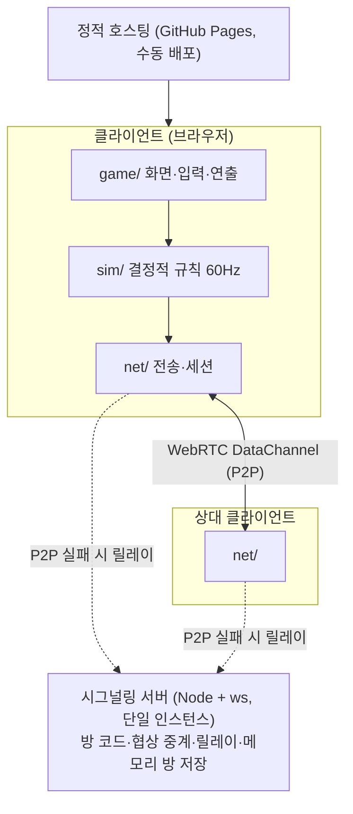
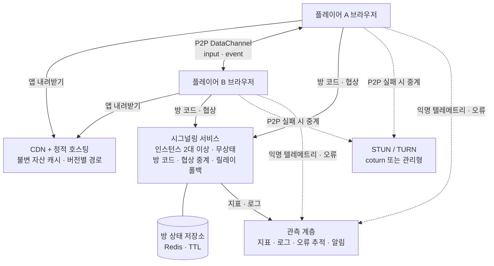
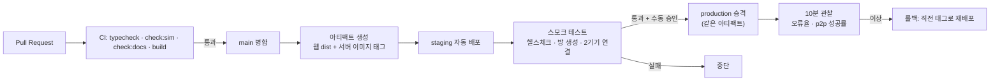

# 아키텍처 정의서 — Arena Shooter

| 항목 | 내용 |
|------|------|
| 시스템명 | Arena Shooter (『파이브 스타 스토리』 팬 게임) |
| 문서 종류 | 아키텍처 정의서 (목표 아키텍처, 비기능 요구, 운영 체계, 갭 분석) |
| 작성일 | 2026-09-20 |
| 대상 독자 | 이 시스템을 이어받을 개발자, 실제 운영을 검토하는 사람 |
| 상태 | **목표(To-Be) 문서.** 4장 이후의 상당 부분은 아직 구현되지 않았다. 지금 구현된 것은 3장과 [프로그램 명세서](프로그램_명세서.md)에 있다 |

> **읽기 전에** — 이 문서는 "제대로 운영한다면 무엇이 필요한가"를 적은 것이다. 지금은 개인 취미 프로젝트이고, 아래 요소 대부분이 없다. 없는 것을 있는 것처럼 적지 않기 위해 **3장(현행)과 4장(목표)을 나누고, 7장에 갭과 단계별 계획**을 두었다. 각 요소가 무엇이고 왜 필요한지는 [별첨 A](#별첨-a-아키텍처-요소-상세)에 하나씩 설명한다.

> **정책 제약** — 팬 게임이므로 **공개 배포·수익화·공개 랭킹을 하지 않는다.** 이 제약은 선택 사항이 아니라 아키텍처의 전제다. "이상적인 아키텍처"란 여기서 *대규모 상용 게임 서비스*가 아니라, **이 제약 안에서 소규모(지인 범위)로 안정적으로 돌릴 수 있는 구조**를 뜻한다. 규모가 필요한 선택지는 별첨에 "필요해지면"으로 적어 둔다.

---

## 목차

1. [문서의 목적과 범위](#1-문서의-목적과-범위)
2. [아키텍처 원칙](#2-아키텍처-원칙)
3. [현행 아키텍처 (As-Is)](#3-현행-아키텍처-as-is)
4. [목표 아키텍처 (To-Be)](#4-목표-아키텍처-to-be)
5. [비기능 요구사항과 측정](#5-비기능-요구사항과-측정)
6. [아키텍처 결정 기록 (ADR)](#6-아키텍처-결정-기록-adr)
7. [갭 분석과 단계별 계획](#7-갭-분석과-단계별-계획)
8. [리스크 등록부](#8-리스크-등록부)
9. [별첨 A: 아키텍처 요소 상세](#별첨-a-아키텍처-요소-상세)
10. [별첨 B: 운영 런북 초안](#별첨-b-운영-런북-초안)
11. [별첨 C: 용어](#별첨-c-용어)

---

## 1. 문서의 목적과 범위

### 1.1 목적
- 이 시스템을 **지인 범위에서 상시 운영**한다고 할 때 필요한 구성 요소, 품질 기준, 운영 절차를 정의한다.
- 지금 없는 것과 있는 것을 구분해, 다음에 무엇부터 만들지 판단할 수 있게 한다.

### 1.2 범위

| 포함 | 제외 |
|------|------|
| 클라이언트·시그널링·릴레이·TURN·정적 호스팅, 배포 파이프라인, 관측성, 보안, 운영 절차, 용량·비용 | 공개 상용 서비스화, 결제, 광고, 공개 랭킹, 계정 시스템(선택 항목으로만 다룸) |

### 1.3 관련 문서

| 문서 | 역할 |
|------|------|
| [프로그램 명세서](프로그램_명세서.md) | 구현된 프로그램의 입력·출력·데이터·패킷 |
| [개발자 매뉴얼](개발자_매뉴얼.md) | 왜 그렇게 만들었는지, 동기화 모델 상세 |
| [실기 테스트 가이드](실기_테스트_가이드.md) | 실제 기기 검증 절차 |
| [게임 매뉴얼](게임_매뉴얼.md) | 플레이 방법 |

---

## 2. 아키텍처 원칙

원칙은 **선택이 갈릴 때 무엇을 우선하는가**를 정한다. 아래는 이 시스템에서 이미 지켜 온 것과, 운영을 전제로 추가한 것이다.

| # | 원칙 | 뜻 | 적용 예 |
|---|------|----|--------|
| P1 | 게임 규칙은 순수하게 | 규칙 계층은 화면·네트워크·시간에 의존하지 않는다 | `sim/`이 Phaser·DOM·Date를 쓰지 않아 헤드리스 검사와 서버 재현이 가능 |
| P2 | 한쪽이 권위를 갖는다 | 상태의 진실은 한 곳에만 있다 | 방을 만든 쪽이 권위. 참가한 쪽은 예측만 |
| P3 | 지연은 감추되 속이지 않는다 | 체감 지연은 줄이되, 판정은 권위 상태로 | 예측·보간·되감기, 판정은 항상 권위 위치 |
| P4 | 실패를 기본값으로 설계 | 연결·저장소·이미지·카메라는 없을 수 있다 | 릴레이 폴백, 저장소 예외 시 기본값, 이미지 없으면 카드 생략 |
| P5 | 관측할 수 없으면 운영할 수 없다 | 이상을 사람의 제보가 아니라 수치로 본다 | 경기 기록 파일, 진단 줄. 목표: 원격 텔레메트리 |
| P6 | 숫자는 기계가 검증한다 | 문서·밸런스의 수치는 손으로 믿지 않는다 | `check:sim`, `check:balance`, `check:docs` |
| P7 | 개인정보를 모으지 않는다 | 수집하지 않은 정보는 유출되지 않는다 | 계정 없음, 전적은 기기에만, 로그에 식별자 없음 |
| P8 | 되돌릴 수 있게 바꾼다 | 배포는 언제든 직전으로 | 정적 자산 해시, 서버 이미지 태그 고정, 롤백 절차 |
| P9 | 작게 유지한다 | 없는 구성 요소는 고장 나지 않는다 | 상태 저장소 없이 메모리 방, 필요해질 때만 추가 |
| P10 | 정책이 설계를 이긴다 | 팬 게임 제약은 기술로 우회하지 않는다 | 공개 배포·랭킹·수익화 금지, 일러스트는 저장소 밖 |

---

## 3. 현행 아키텍처 (As-Is)

### 3.1 구성

### 3.2 현행 특성

| 항목 | 현재 |
|------|------|
| 권위 | 방을 만든 클라이언트 |
| 방 상태 | 시그널링 서버 메모리 (재시작 시 소멸) |
| 확장 | 인스턴스 1대 전제 |
| NAT 통과 | 공개 STUN만. TURN 없음 |
| 관측성 | 클라이언트 진단 줄, 수동 내보내는 경기 기록 파일. 서버 지표·로그 수집 없음 |
| 배포 | 웹은 수동 트리거 Actions, 서버는 Render 블루프린트. 스테이징 없음 |
| 테스트 | 헤드리스 규칙 검사 53개, 밸런스 측정, 문서 대조. 실기 수동 |
| 인증 | 없음. 방 코드 6자리 + 재접속 토큰(UUID) |
| 데이터 | 서버 영속 데이터 없음. 전적은 브라우저 로컬 |
| 알림 | 없음 (장애를 알 방법이 없다) |

### 3.3 현행의 한계 (운영 관점)

1. **서버가 죽으면 아무도 모른다.** 지표·알림·로그가 없다.
2. **서버 재시작 = 진행 중 방 전부 소멸.** 상태가 메모리에만 있다.
3. **셀룰러 간 연결이 뚫리지 않을 수 있다.** TURN이 없어 대칭 NAT 조합에서 P2P가 실패하고, 릴레이는 단일 서버를 거친다.
4. **스테이징이 없다.** 배포 전에 실제와 같은 환경에서 검증할 곳이 없다.
5. **클라이언트 오류가 보고되지 않는다.** 사용자가 말해 주지 않으면 모른다.
6. **남용 방지 장치가 없다.** 방 생성·메시지에 제한이 없다.

---

## 4. 목표 아키텍처 (To-Be)

### 4.1 전체 구성

핵심 변화는 네 가지다. **방 상태를 인스턴스 밖으로**, **NAT 통과를 TURN으로 보강**, **관측 계층 신설**, **배포를 환경별로 분리**.

### 4.2 논리 아키텍처

| 계층 | 책임 | 구성 요소 | 변경 여부 |
|------|------|----------|----------|
| 규칙 | 결정적 게임 진행, 승패 | `sim/` | 그대로 |
| 동기화 | 권위·예측·보간·되감기 | `game/sync/` | 그대로 |
| 표현 | 화면·입력·연출·사운드 | `game/`, `ui/` | 텔레메트리 훅 추가 |
| 전송 | 채널 추상화, 세션 복구 | `net/` | TURN 자격증명 수신, 프로토콜 버전 협상 추가 |
| 접속 중개 | 방 코드, 협상 중계, 릴레이 | 시그널링 서비스 | 무상태화, 레이트리밋, 헬스·지표 |
| 상태 | 방·슬롯·토큰 | Redis (TTL 60초 내외) | 신설 |
| 전달 | 정적 자산 | CDN + 버전 경로 | 신설(현재는 단일 Pages) |
| 관측 | 지표·로그·오류·알림 | 별첨 A7~A9 | 신설 |

### 4.3 환경 구성

| 환경 | 목적 | 데이터 | 배포 트리거 | 접근 |
|------|------|--------|-----------|------|
| local | 개발 | 없음 | `npm run play` | 개발자 |
| staging | 배포 전 검증(실기 2대) | 실제와 동일 구조, 분리된 Redis·TURN | `main` 병합 시 자동 | 링크를 아는 사람 |
| production | 지인 플레이 | 영속 데이터 없음 | 수동 승인 후 승격 | 링크를 아는 사람 |

**승격 규칙**: production에는 staging에서 검증한 **같은 아티팩트**를 올린다. 다시 빌드하지 않는다(별첨 A13).

### 4.4 통신·프로토콜 운영 정책

| 항목 | 정책 |
|------|------|
| 버전 협상 | 첫 `event` 패킷에 프로토콜 버전을 싣고, 다르면 "앱을 새로고침해 주세요"로 안내하고 경기를 시작하지 않는다 |
| 호환성 | 스냅샷 구조 변경은 **깨는 변경**으로 간주. 버전 올림 + 양쪽 강제 갱신 |
| 채널 | 지금 구조 유지(input 지연 우선 / event 신뢰) |
| 크기 상한 | 서버는 릴레이 프레임 크기를 제한(예: 4KB)하고 초과 시 연결 종료 |
| 시계 | 서버 시각에 의존하지 않는다. 모든 동기화는 틱과 RTT로만 |

### 4.5 데이터 아키텍처

| 데이터 | 저장 위치 | 보존 | 개인정보 | 비고 |
|--------|----------|------|---------|------|
| 경기 상태 | 클라이언트 메모리 | 경기 동안 | 없음 | 서버에 저장하지 않음 |
| 방·슬롯·토큰 | Redis | TTL 60초(유예 15초의 4배) | 없음 | 인스턴스 재시작 무관 |
| 로컬 전적 | 브라우저 localStorage | 사용자가 지울 때까지 | 기기 내 | 서버 전송 없음 |
| 경기 기록 파일 | 사용자 기기(내려받기) | 사용자 관리 | 브라우저 UA 포함 | 공유는 사용자 판단 |
| 서버 로그 | 로그 수집기 | 14일 | IP는 저장 시 마스킹 | 별첨 A8 |
| 지표 | 시계열 DB | 30일 | 없음 | 별첨 A7 |
| 클라이언트 오류 | 오류 추적 서비스 | 30일 | 없음(사용자 식별자 미전송) | 별첨 A15 |

**원칙**: 서버는 **게임 데이터를 저장하지 않는다.** 저장하는 순간 백업·삭제 요청·유출 대응이 생긴다(P7, P9).

### 4.6 보안 아키텍처

위협을 STRIDE로 훑고, 이 시스템에 실제로 해당하는 것만 남겼다.

| 위협 | 시나리오 | 대응 |
|------|---------|------|
| 스푸핑 | 남의 방에 난입 | 6자리 코드 + 재접속 토큰(UUID v4). 방 정원 2명 초과 거부 |
| 변조 | 조작된 패킷으로 상대 상태 훼손 | 권위는 방을 만든 쪽. 참가자 패킷은 입력뿐이며 디코더가 길이·범위 검증 |
| 부인 | — | 해당 없음(계정·거래 없음) |
| 정보 노출 | 시그널링 경유 내용 노출 | wss(TLS). 게임 데이터는 P2P는 DTLS, 릴레이는 TLS. 서버는 내용을 해석하지 않음 |
| 서비스 거부 | 방 대량 생성, 대형 프레임 폭주 | IP당 방 생성·메시지 레이트리밋, 프레임 크기 상한, 유휴 소켓 정리(별첨 A10) |
| 권한 상승 | 치팅으로 승리 | 대전은 호스트 권위라 참가자 조작은 막힌다. **호스트 자신의 치팅은 막지 못한다** → 공개 랭킹을 두지 않음으로 무해화(P10) |

추가 조치

| 항목 | 내용 |
|------|------|
| 비밀 관리 | TURN 자격증명·배포 토큰은 저장소에 두지 않는다. 배포 환경 변수/시크릿에만 |
| TURN 자격증명 | 장기 자격증명 대신 **시간 제한 HMAC 자격증명**을 시그널링이 발급 |
| 의존성 | 자동 취약점 점검(예: `npm audit`, Dependabot)과 잠금 파일 고정 |
| 헤더 | 정적 호스팅에 CSP·Referrer-Policy·Permissions-Policy 적용 |
| 카메라 | QR 스캔은 사용자 조작 시에만, https에서만 |

### 4.7 관측성

세 가지를 나눠 본다. **지표**(무슨 일이 얼마나), **로그**(무슨 일이 왜), **오류 추적**(클라이언트에서 무엇이 깨졌나).

| 이름 | 종류 | 출처 | 알림 임계 |
|------|------|------|----------|
| `rooms_active` | 게이지 | 시그널링 | — (대시보드) |
| `room_create_total` / `join_fail_total{code}` | 카운터 | 시그널링 | 실패율 10% 초과 5분 |
| `p2p_success_ratio` | 게이지 | 클라이언트 → 텔레메트리 | 70% 미만 15분 |
| `relay_bytes_total` | 카운터 | 시그널링 | 예산의 80% 도달 |
| `ws_connections` | 게이지 | 시그널링 | 인스턴스당 상한의 80% |
| `signaling_up` | 프로브 | 외부 헬스체크 | 2회 연속 실패 |
| `client_error_rate` | 카운터 | 오류 추적 | 세션 대비 5% 초과 |
| `host_tick_rate_p10` | 히스토그램 | 클라이언트 텔레메트리 | 45t/s 미만 비율 증가 |

클라이언트 텔레메트리는 **익명·표본**이다. 경기 종료 시 한 번, 식별자 없이 요약만 보낸다(모드, RTT 분위수, 호스트 틱 속도, 전송 종류, 오류 코드). 옵트아웃 스위치를 제공한다.

### 4.8 가용성·확장성

| 항목 | 목표 | 수단 |
|------|------|------|
| 시그널링 가용성 | 월 99% (지인 범위 기준) | 인스턴스 2대 + 헬스체크 + 무상태화 |
| 재시작 영향 | 진행 중 경기 중단 없음 | 방 상태 Redis, 클라이언트 재접속(10초 창) |
| 수평 확장 | 인스턴스 추가로 선형 | 상태 외부화, 스티키 세션 불필요(별첨 A4) |
| 릴레이 대역 | 예산 내 | 동시 방 상한과 릴레이 비율 모니터링 |
| 저하 모드 | Redis 장애 시에도 새 방 생성 가능 | 메모리 폴백 + "재시작 시 방 소멸" 경고 |

### 4.9 용량 산정

측정된 패킷 크기로 계산한 값이다(협동 기준이 더 크다).

| 항목 | 값 | 근거 |
|------|----|------|
| 입력 | 20B × 60Hz = **1.2 KB/s** | 입력 패킷 20바이트 |
| 스냅샷(대전) | 약 449B × 20Hz = **8.8 KB/s** | 탄 10발 기준 |
| 스냅샷(협동) | 약 752B × 20Hz = **14.7 KB/s** | 탄 14발 + 적 12기 |
| P2P 경기 1판 | 위 합계, 서버 부하 0 | 협상 메시지 수 KB만 서버 경유 |
| **릴레이 경기 1판** | 약 **16 KB/s ≈ 130 kbps** (서버 통과) | 협동 기준 |
| 동시 100방 릴레이 | 약 **13 Mbps**, 1시간 **5.8 GB** | 최악 가정(전부 릴레이) |
| 현실 가정(릴레이 20%) | 약 2.6 Mbps, 1시간 1.2 GB | P2P 성공률 80% 가정 |

**해석**: 지인 범위(동시 수 방)라면 무료 등급으로 충분하다. 릴레이 비율이 올라가면 비용이 선형으로 는다. 그래서 `p2p_success_ratio`가 비용 지표이기도 하다.

### 4.10 비용 모델

| 구성 | 무료로 가능 | 유료 전환 시점 | 대략 비용 |
|------|------------|--------------|----------|
| 정적 호스팅/CDN | 예 (GitHub Pages, Cloudflare Pages) | 대역 초과 | 소액 |
| 시그널링 | 예 (Render 무료, 슬립 있음) | 슬립 제거·2대 상시 | 월 $7~14 |
| Redis | 예 (무료 등급 소용량) | 영속·백업 필요 시 | 월 $0~10 |
| TURN | 아니오 | 셀룰러 간 연결 필요 시 | 자체 호스팅 월 $5~ / 관리형 트래픽 과금 |
| 관측성 | 예 (무료 등급) | 보존 기간·용량 | 월 $0~20 |

### 4.11 배포·릴리스

| 항목 | 정책 |
|------|------|
| 버전 | 커밋 SHA를 아티팩트 태그로. 클라이언트에 빌드 ID를 심어 오류 보고와 대응 |
| 정적 자산 | 내용 해시 파일명, 장기 캐시. `index.html`은 캐시 금지 |
| 서비스워커 | 자동 갱신, 새 버전은 다음 실행부터. 강제 갱신이 필요하면 버전 협상(4.4)으로 차단 |
| 롤백 | 웹은 직전 아티팩트 재배포, 서버는 직전 이미지 태그로 재시작. 5분 내 |
| 변경 창 | 사람이 플레이하지 않는 시간대 선호. 경기 중 재시작은 재접속 창(10초) 안에 끝나야 한다 |

### 4.12 운영 프로세스

| 항목 | 정의 |
|------|------|
| 인시던트 등급 | **S1** 아무도 못 논다(시그널링 다운) · **S2** 다수가 못 논다(연결 성공률 급락) · **S3** 일부 기능 이상 |
| 대응 시간 목표 | S1 1시간 내 조치 시작(취미 운영 기준), S2 당일, S3 다음 작업 때 |
| 온콜 | 1인 운영. 알림은 모바일 푸시 1채널로 단순화 |
| 런북 | 별첨 B. 증상 → 확인 → 조치 순서 |
| 사후 기록 | S1·S2는 짧은 회고를 `docs/회고.md`에 한 단락으로 남긴다 |
| 백업 | 서버 영속 데이터가 없으므로 백업 대상은 **저장소와 배포 설정**뿐. 저장소는 GitHub, 설정은 IaC 파일로 커밋 |
| DR | 전체 재구축 목표 2시간(블루프린트 + Actions로 재배포). 데이터 손실 대상 없음 |

---

## 5. 비기능 요구사항과 측정

| 분류 | 요구 | 목표값 | 측정 방법 | 현재 |
|------|------|--------|----------|------|
| 성능 | 입력 지연(로컬 화면) | 프레임 1개(16ms) 이내 | 예측 적용 확인(코드·실기) | 달성 |
| 성능 | 프레임률 | 중급 폰 55fps 이상 90% 구간 | 실기 측정, 저사양 파티클 저감 | 부분 달성(자동 저감만) |
| 성능 | 호스트 틱 | 60t/s, 45 미만 경고 | 참가자 측 측정·경고 | 달성 |
| 지연 | 같은 Wi‑Fi RTT | 50ms 이하 | 진단 줄·경기 기록 | 달성(실측 5.8ms) |
| 연결 | 같은 Wi‑Fi 페어링 성공률 | 95% 이상 | 텔레메트리 | 미측정 |
| 연결 | 셀룰러 간 성공률 | 85% 이상 | 텔레메트리(TURN 도입 후) | 미달(TURN 없음) |
| 복구 | 끊김 후 복구율 | 80% 이상 | 텔레메트리 | 미측정 |
| 가용성 | 시그널링 월 가용성 | 99% | 외부 프로브 | 미측정 |
| 용량 | 동시 방 | 100방까지 저하 없음 | 부하 시험 스크립트 | 미검증 |
| 보안 | 전송 암호화 | 전 구간 TLS/DTLS | 설정 점검 | 달성 |
| 보안 | 개인정보 수집 | 0건 | 코드 점검 | 달성 |
| 품질 | 규칙 회귀 | 헤드리스 검사 전부 통과 | `check:sim` | 달성(53개) |
| 품질 | 문서 정확성 | 문서 수치와 코드 일치 | `check:docs` | 달성 |
| 접근성 | 조작 대안 | 터치·키보드·마우스 모두 지원 | 실기 | 달성 |
| 유지보수 | 계층 규칙 위반 | 0건 | import 검사(추가 예정) | 수동 확인 |

---

## 6. 아키텍처 결정 기록 (ADR)

이미 내린 결정과, 목표 아키텍처에서 내려야 할 결정을 한 표로 둔다. 상세 배경은 개발자 매뉴얼 3장·7장에 있다.

| ID | 결정 | 상태 | 대안 | 이유 |
|----|------|------|------|------|
| ADR-01 | 호스트 권위 P2P | 채택 | 전용 서버 권위 | 서버 비용 0, 근거리 지연 최소. 치팅은 랭킹 부재로 무해화 |
| ADR-02 | 규칙 계층 순수 분리 | 채택 | 씬에 규칙 내장 | 헤드리스 검사·게스트 예측 재사용 |
| ADR-03 | 바이너리 수동 직렬화 | 채택 | JSON | 약 5배 작음, 레이아웃 통제 |
| ADR-04 | 채널 2개(지연/신뢰) | 채택 | 단일 신뢰 채널 | 입력은 최신성이, 선택·신호는 도달이 중요 |
| ADR-05 | 릴레이 폴백 | 채택 | TURN 우선 | 비용 0으로 "연결은 된다"를 보장 |
| ADR-06 | Phaser 채택 | 채택 | PixiJS 직접 구현 | 일정. 대가는 번들 1.7MB |
| ADR-07 | 방 상태 외부화(Redis) | **제안** | 메모리 유지 | 무중단 재시작·수평 확장. 대가: 구성 요소 +1 |
| ADR-08 | TURN 도입 | **제안** | 릴레이만 | 셀룰러 간 성공률. 대가: 비용·운영 |
| ADR-09 | 익명 텔레메트리 | **제안** | 수동 기록 파일만 | 품질 목표를 수치로 관리. 대가: 옵트아웃·정책 관리 |
| ADR-10 | staging 환경 신설 | **제안** | 로컬 검증만 | 배포 사고 예방 |
| ADR-11 | 프로토콜 버전 협상 | **제안** | 무버전 | 구버전 클라이언트와의 조용한 오작동 차단 |

---

## 7. 갭 분석과 단계별 계획

우선순위는 **"없으면 운영 중 눈이 먼다" → "사용자가 못 논다" → "편의"** 순이다.

| 단계 | 목표 | 작업 | 완료 기준 | 예상 규모 |
|------|------|------|----------|----------|
| **P0 관측** | 장애를 안다 | 시그널링 `/metrics`, 구조화 로그, 외부 헬스 프로브, 알림 1채널 | 서버를 죽이면 5분 내 알림이 온다 | 1~2일 |
| **P0 안전장치** | 남용 차단 | IP당 방 생성·메시지 레이트리밋, 프레임 크기 상한 | 부하 스크립트로 확인 | 0.5일 |
| **P1 무중단** | 재시작에 강하게 | 방 상태 Redis 외부화, 메모리 폴백 | 재시작 중 경기가 이어진다 | 1~2일 |
| **P1 환경 분리** | 배포 사고 예방 | staging + 스모크 테스트 + 승격/롤백 | 롤백 5분 내 성공 시연 | 1~2일 |
| **P2 연결 품질** | 셀룰러 간 연결 | TURN(자체 또는 관리형), 시간 제한 자격증명 | 서로 다른 통신사에서 성공률 85% | 2~3일 |
| **P2 텔레메트리** | 품질을 수치로 | 익명 요약 전송 + 옵트아웃 + 대시보드 | p2p 성공률·틱 속도 그래프 | 1~2일 |
| **P3 견고성** | 조용한 오작동 차단 | 프로토콜 버전 협상, 클라이언트 오류 추적 | 구버전은 안내 후 차단 | 1일 |
| **P3 자동화** | 회귀 방지 | 계층 import 검사, 부하 시험 스크립트, 의존성 점검 | CI에서 자동 실행 | 1일 |

> 이 계획은 **전제 조건부**다. 지금처럼 가끔 지인과 플레이하는 용도라면 P0만으로 충분하고, 상시 접속을 열어 둘 때 P1 이상이 필요해진다.

---

## 8. 리스크 등록부

| ID | 리스크 | 영향 | 가능성 | 대응 |
|----|--------|------|-------|------|
| R1 | 저작권(원작 일러스트) | 배포 중단 요구 | 중 | 저장소·배포본에서 제외, 비공개·비수익 유지, 요청 시 즉시 내림 |
| R2 | 무료 등급 서비스 정책 변경 | 서버 중단 | 중 | IaC로 다른 제공자 재배포 가능 상태 유지 |
| R3 | 호스트 기기 성능 저하 | 양쪽 경기 품질 저하 | 중 | 경고 표시(구현됨), 호스트 교대 안내 |
| R4 | 셀룰러 NAT 조합 실패 | 연결 불가 | 중 | TURN 도입(P2), 실패 시 릴레이 안내 |
| R5 | 브라우저 API 변경(WebRTC·Wake Lock) | 기능 정지 | 낮음 | 기능 탐지 후 저하 모드, 릴레이 폴백 |
| R6 | 치팅 | 재미 훼손 | 낮음 | 랭킹 부재. 필요 시 서버 권위 전환(대규모 변경) |
| R7 | 1인 운영 부재 | 장애 장기화 | 중 | 저하 모드 설계, 자동 재시작, 알림 단순화 |
| R8 | 번들 크기로 첫 로딩 지연 | 이탈 | 낮음 | CDN·캐시, 필요 시 PixiJS 전환 검토(ADR-06 재고) |

---

# 별첨 A: 아키텍처 요소 상세

각 요소는 **무엇인가 / 왜 필요한가 / 선택지 / 이 시스템의 권고 / 없을 때의 증상** 순으로 적는다.

## A1. 시그널링 서비스

- **무엇**: 두 브라우저가 서로의 주소와 연결 조건(SDP·ICE)을 교환하도록 중개하는 서버. 게임 데이터는 원칙적으로 지나가지 않는다.
- **왜**: 브라우저는 상대의 주소를 알 방법이 없다. 방 코드로 짝을 찾아 주는 최소한의 중앙 지점이 필요하다.
- **선택지**: ① 자체 Node + ws(현행) ② 관리형 실시간 서비스(Ably·Pusher) ③ 서버리스(Cloudflare Workers + Durable Objects).
- **권고**: 현행 유지 + 무상태화. 방 하나가 몇 KB의 JSON만 오가므로 자체 운영이 가장 싸고 단순하다. 서버리스는 방 상태를 Durable Object가 대신 들어 주므로 A4가 필요 없어지는 장점이 있다.
- **없을 때**: 코드·QR 교환 자체가 불가능. P2P 연결을 시작할 방법이 없다.

## A2. STUN / TURN

- **무엇**: STUN은 "내 공인 주소가 무엇인지" 알려 주는 조회 서버. TURN은 P2P가 막혔을 때 **미디어·데이터를 대신 중계**하는 서버.
- **왜**: 같은 Wi‑Fi면 대개 직접 붙지만, 통신사 NAT(특히 대칭 NAT) 조합에서는 직접 경로가 뚫리지 않는다.
- **선택지**: ① 공개 STUN만(현행) ② coturn 자체 호스팅 ③ 관리형 TURN(Twilio·Cloudflare Calls 등) ④ TURN 없이 앱 릴레이(현행 폴백).
- **권고**: 지인 범위·같은 Wi‑Fi 중심이면 현행으로 충분. 셀룰러 간 플레이를 열려면 관리형 TURN을 먼저 시험하고, 트래픽이 늘면 coturn으로 옮긴다. 자격증명은 **시간 제한 HMAC**으로 발급해 유출 피해를 줄인다.
- **없을 때**: 일부 네트워크 조합에서 5초를 기다린 뒤 앱 릴레이로 떨어지고, 릴레이 서버 대역을 소모한다.

## A3. 애플리케이션 릴레이(현행 폴백)

- **무엇**: P2P가 실패하면 시그널링 소켓으로 게임 패킷을 그대로 중계하는 경로.
- **왜**: TURN이 없어도 "연결은 된다"를 보장하기 위한 마지막 수단.
- **주의**: 서버가 게임 대역폭을 떠안는다(협동 기준 방당 약 130 kbps). 그래서 릴레이 비율은 비용·용량 지표다.
- **권고**: 유지하되, 프레임 크기 상한과 동시 릴레이 방 수 상한을 둔다. TURN 도입 후에도 최후 폴백으로 남긴다.

## A4. 방 상태 저장소

- **무엇**: 방 코드 → 슬롯(역할·토큰·연결 상태)의 단기 저장소.
- **왜**: 지금은 인스턴스 메모리에 있어 **재시작하면 전부 사라지고, 인스턴스를 늘릴 수 없다.**
- **선택지**: ① 메모리(현행) ② Redis(TTL) ③ Durable Objects 같은 위치 고정 액터 ④ 스티키 세션으로 메모리 유지.
- **권고**: Redis + TTL 60초. 값이 수백 바이트이고 수명이 짧아 부담이 거의 없다. Redis가 죽으면 메모리 폴백으로 **새 방은 만들 수 있게** 하고 화면에 경고를 띄운다(저하 모드).
- **없을 때**: 배포·재시작 때마다 진행 중 경기가 끊기고, 서버를 2대로 늘리면 같은 방 코드를 서로 모른다.

## A5. 정적 호스팅과 CDN

- **무엇**: 빌드 산출물(HTML·JS·이미지)을 전 세계 가장자리에서 내려 주는 계층.
- **왜**: 번들이 1.7MB(gzip 434KB)라 첫 로딩이 네트워크에 좌우된다. 또한 정적 파일에는 서버가 필요 없다.
- **권고**: 내용 해시가 붙은 자산은 장기 캐시(`immutable`), `index.html`은 `no-store`. 배포는 새 파일 업로드 후 `index.html` 교체 순서로 해야 반쯤 갱신된 상태를 피한다.
- **없을 때**: 첫 로딩이 느리고, 배포 중 일부 파일만 바뀐 상태로 접속하면 깨진 화면이 나올 수 있다.

## A6. PWA와 서비스워커

- **무엇**: 홈 화면 설치와 오프라인 캐시를 담당하는 브라우저 기능.
- **왜**: "설치 없이"가 이 게임의 핵심인데, 반대로 자주 하는 사람에게는 앱처럼 보이는 편이 낫다.
- **주의**: 서비스워커는 **옛 버전을 계속 보여 줄 수 있다.** 그래서 프로토콜 변경 시 버전 협상(4.4)이 필요하다.
- **권고**: 자동 갱신 유지 + 갱신 알림. 긴급 시 `index.html`과 서비스워커를 함께 교체해 강제 갱신.

## A7. 지표 수집

- **무엇**: 수치의 시간 변화(방 수, 실패율, 대역폭 등).
- **왜**: 장애를 **사람이 말하기 전에** 알고, 용량·비용을 예측하기 위해.
- **선택지**: ① Prometheus + Grafana 자체 ② 관리형(Grafana Cloud 무료 등급) ③ 호스팅 제공자 기본 지표.
- **권고**: 서버에 `/metrics`(Prometheus 형식)를 열고 관리형으로 스크레이프. 지표는 4.7 표의 8개로 시작한다. 지표는 적을수록 좋다.
- **없을 때**: 문제를 사후에만 알고, 원인 후보를 좁힐 수 없다.

## A8. 로그

- **무엇**: 사건의 기록. 지금은 `console.log` 몇 줄뿐이다.
- **권고**: JSON 한 줄 구조(`ts, level, event, room, role, detail`)로 바꾸고 수집기로 보낸다. **방 코드는 해시**, IP는 마스킹. 보존 14일.
- **주의**: 게임 패킷 내용은 절대 남기지 않는다(용량·사생활).
- **없을 때**: "그때 무슨 일이 있었나"를 재구성할 수 없다.

## A9. 알림

- **무엇**: 임계값을 넘으면 사람을 부르는 경로.
- **권고**: 1인 운영이므로 채널 하나(모바일 푸시). **S1만 즉시 알림**, 나머지는 일간 요약. 알림이 잦으면 무시하게 되므로 임계는 보수적으로.
- **없을 때**: 서버가 밤새 죽어 있어도 모른다.

## A10. 레이트리밋과 남용 방지

- **무엇**: 한 IP·소켓이 만들 수 있는 방 수, 초당 메시지 수, 프레임 크기의 상한.
- **왜**: 공개 주소를 가진 WebSocket 서버는 자동 스캐너의 표적이 된다.
- **권고**: IP당 분당 방 생성 10회, 소켓당 초당 제어 메시지 20개, 릴레이 프레임 4KB, 인증 없는 유휴 소켓 30초 종료. 초과 시 `error` 후 종료.
- **없을 때**: 한 사람이 서버 메모리와 대역을 고갈시킬 수 있다.

## A11. 인증 (선택)

- **무엇**: 사용자를 식별하는 체계.
- **이 시스템의 입장**: **도입하지 않는다.** 방 코드와 토큰으로 충분하고, 계정을 두는 순간 개인정보·보관·삭제 의무가 생긴다(P7).
- **필요해지는 조건**: 친구 목록, 서버 저장 전적, 공개 랭킹 — 모두 팬 게임 정책상 하지 않기로 한 것들이다.

## A12. 데이터 보존과 삭제

- **무엇**: 무엇을 얼마나 두고, 어떻게 지우는가.
- **권고**: 4.5 표대로. 서버 영속 데이터 없음, 로그 14일, 지표 30일. 사용자 데이터는 기기 안에 있으므로 "브라우저 데이터 삭제"가 곧 완전 삭제다. 이 사실을 게임 매뉴얼에 한 줄로 적어 둔다.

## A13. CI/CD

- **무엇**: 변경을 검사하고 배포까지 자동으로 잇는 파이프라인.
- **권고**: PR에서 `typecheck` + `check:sim` + `check:docs` + `build`. main 병합 시 아티팩트를 만들고 staging 자동 배포, production은 **같은 아티팩트를 수동 승인으로 승격**. 재빌드 금지(재빌드는 다른 결과물을 만들 수 있다).
- **없을 때**: "내 컴퓨터에서는 됐는데"가 배포로 나간다.

## A14. 테스트 전략

- **무엇**: 무엇을 어떤 층에서 검증하는가.

| 층 | 대상 | 도구 | 현재 |
|----|------|------|------|
| 규칙 | 시뮬레이션·패킷·동기화 | `check:sim` (53개) | 있음 |
| 밸런스 | 난이도·클리어율 | `check:balance` | 있음 |
| 문서 | 수치 일치 | `check:docs` | 있음 |
| 통합 | 두 클라이언트 실제 연결 | 헤드리스 브라우저 2개 + 가짜 시그널링 | **없음(권고)** |
| 부하 | 동시 방 수·릴레이 대역 | 가상 클라이언트 스크립트 | **없음(권고)** |
| 실기 | 조작·화면·연결 | 사람 + 체크리스트 | 있음 |

- **권고**: 통합·부하 두 칸을 채우면 P1·P2 작업을 자신 있게 할 수 있다.

## A15. 클라이언트 오류 추적

- **무엇**: 브라우저에서 난 예외·거부된 Promise를 모아 보는 서비스(Sentry 등).
- **권고**: 도입하되 **식별자·IP를 보내지 않는 설정**으로. 빌드 ID를 함께 보내 어떤 배포에서 깨졌는지 본다. 옵트아웃 제공.
- **없을 때**: 특정 기기에서만 나는 오류를 영영 모른다.

## A16. 기능 플래그

- **무엇**: 배포와 공개를 분리하는 스위치.
- **권고**: 지금 규모에서는 **URL 매개변수와 로컬 설정으로 충분**하다(이미 `?debug`, 조준 보정 토글이 그 역할). 원격 플래그 서비스는 과하다.

## A17. 구성 관리

- **무엇**: 환경별 설정값(시그널링 주소, TURN, 샘플링 비율)의 관리.
- **권고**: 빌드 시 주입(`VITE_*`)을 유지하되, **런타임 설정이 필요한 값은 작은 JSON을 CDN에서 읽는 방식**으로 분리한다. 그래야 TURN 서버를 바꿀 때 재빌드가 필요 없다. 비밀은 클라이언트에 두지 않는다.

## A18. 온콜과 인시던트 관리

- **무엇**: 누가 언제 대응하고, 어떤 순서로 처리하는가.
- **권고**: 1인 운영에 맞춰 단순화. 등급은 셋(4.12), 런북은 별첨 B, 사후 기록은 한 단락. 대응 시간은 현실적으로 약속한다(취미 운영임을 사용자에게 알린다).

## A19. 백업과 재해 복구

- **무엇**: 잃으면 곤란한 것을 복제해 두고, 전부 잃었을 때 되살리는 절차.
- **이 시스템**: 서버 영속 데이터가 없으므로 백업 대상은 **저장소와 배포 설정**이다. 따라서 DR은 "다시 배포"와 같다.
- **권고**: 블루프린트(`render.yaml`)와 워크플로를 커밋 상태로 유지하고, 복구 절차를 별첨 B에 적어 둔다. 목표 복구 시간 2시간.

## A20. 비용 관리

- **무엇**: 무엇이 돈을 쓰는지 알고 한도를 두는 것.
- **권고**: 대역폭이 유일한 변동비다. `relay_bytes_total`에 월 예산 알림을 걸고, 예산의 80%에 도달하면 동시 릴레이 방 수를 제한한다(저하 모드). 무료 등급이 정책을 바꿀 수 있으므로 R2와 함께 본다.

## A21. 접근성과 다기기 대응

- **무엇**: 조작 수단, 화면 크기, 입력 방식의 다양성.
- **현재**: 터치·키보드·마우스 지원, UI 배율(844×390 기준, 0.85~1.7배), 조준 보정, 한/영 무관 키 입력, 포커스 이탈 안내.
- **권고**: 색만으로 정보를 주지 않기(HP 바에 수치 병기 검토), 흔들림 줄이기 옵션, 소리 없이도 이해 가능한 표시 유지.

## A22. 국제화 (선택)

- **현재**: 한국어 고정.
- **권고**: 지금은 불필요. 필요해지면 문자열을 한곳으로 모으는 것부터 시작한다(코드 전반에 흩어져 있어 비용이 든다).

---

# 별첨 B: 운영 런북 초안

## B1. 시그널링 서버가 응답하지 않는다 (S1)

1. `curl https://<서버>/healthz` — 응답 없음/5xx 확인
2. 호스팅 대시보드에서 프로세스 상태·최근 배포 확인
3. 최근 배포가 원인으로 보이면 **직전 이미지 태그로 롤백**
4. 아니면 재시작. 메모리 누수 의심 시 지표(`ws_connections`, `rooms_active`) 추이 확인
5. 복구 후: 방 상태가 메모리라면 진행 중 경기는 이미 끝났다. 공지 없음(지인 범위)
6. 사후: 원인 한 단락을 회고에 기록

## B2. 연결 성공률이 급락했다 (S2)

1. `p2p_success_ratio`와 `join_fail_total{code}` 확인
2. `room_not_found`가 많으면 → 서버 재시작으로 방이 사라졌는지 확인(A4 도입 전 흔함)
3. P2P만 실패하고 릴레이는 붙으면 → STUN/TURN 문제. 관리형 TURN 상태 확인
4. 특정 빌드 이후라면 → 클라이언트 롤백
5. 임시 완화: 릴레이 강제 모드 플래그(있다면) 또는 "같은 Wi‑Fi에서 하세요" 안내

## B3. 릴레이 대역이 예산을 넘고 있다

1. `relay_bytes_total` 증가율과 동시 방 수 확인
2. P2P 성공률이 낮다면 원인(A2) 해결이 근본
3. 즉시 조치: 동시 릴레이 방 수 상한을 낮춘다(저하 모드)

## B4. 특정 기기에서만 화면이 깨진다 (S3)

1. 오류 추적에서 해당 빌드 ID·브라우저 버전 확인
2. 재현: 같은 화면 크기로 브라우저 창을 맞추고 확인
3. 회귀라면 롤백, 아니면 다음 배포에 수정 포함

## B5. 전체 재구축 (DR)

1. 저장소에서 `render.yaml` 블루프린트 적용 → 시그널링 서버 생성
2. 환경 변수(TURN 자격증명, 샘플링) 설정
3. Actions "Deploy web to GitHub Pages" 실행(`SIGNALING_URL` 변수 확인)
4. 스모크: `/healthz`, 방 만들기, 두 기기 연결
5. 목표 시간 2시간, 데이터 손실 없음(영속 데이터 부재)

---

# 별첨 C: 용어

| 용어 | 뜻 |
|------|-----|
| 권위(authority) | 상태의 진실을 결정하는 쪽. 이 게임은 방을 만든 클라이언트 |
| 예측(prediction) | 응답을 기다리지 않고 내 입력을 즉시 화면에 반영하는 것 |
| 재조정(reconciliation) | 권위 상태를 받아 아직 확인되지 않은 입력만 다시 적용하는 것 |
| 보간(interpolation) | 과거 두 스냅샷 사이를 이어 부드럽게 그리는 것 |
| 되감기 판정(lag compensation) | 쏜 사람이 본 시점으로 표적을 되돌려 맞았는지 판정하는 것 |
| 스냅샷 | 월드 전체 상태를 담은 주기 패킷 |
| STUN / TURN | 공인 주소 조회 / 중계 서버 |
| SLI / SLO | 서비스 수준 지표 / 목표 |
| 저하 모드(degraded mode) | 일부 기능을 줄여 서비스를 유지하는 상태 |
| 블루/그린, 카나리 | 새 버전을 병행 운영하거나 일부에게만 노출하는 배포 방식 |
| IaC | 인프라를 코드로 정의해 재현 가능하게 만드는 것 |
